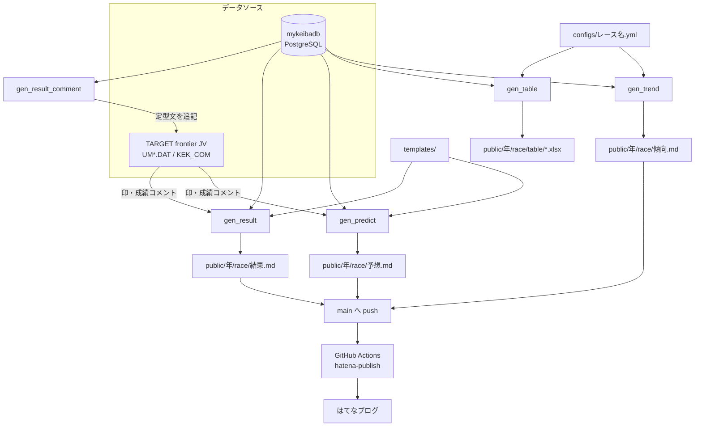

# アーキテクチャ

## このリポジトリの位置づけ

JRA の G1 レースについて、

- **傾向分析記事**（過去10年の着度数・回収率の表）
- **出走馬分析表**（色付き Excel）
- **予想記事**（印と見解）
- **結果記事**（着順と回顧）

を可能な範囲で自動生成し、はてなブログ（`kubotech.hatenadiary.com`）へ公開するための個人用ツール群。

生成されるのは「記事のベース」であり、レースごとの読み・総評・画像などは生成後に手で書き足す前提になっている。

## データソース

| ソース | 取得方法 | 用途 |
| --- | --- | --- |
| mykeibadb（PostgreSQL） | [`mykeibadb-python`](https://github.com/KeibaAI-developer/mykeibadb-python) の `RaceGetter` / `MasterGetter` / `ShussobetsuGetter` / `analytics` | JRA-VAN 由来のレース・出走馬・血統・成績データ |
| 同上（正規化済みビュー） | [`keiba-data-interface`](https://github.com/KeibaAI-developer/keiba-data-interface) の `DataInterface("mykeibadb")` | 日本語カラム名に整形された出走表・結果・過去成績 |
| TARGET frontier JV のデータファイル | `g1_predict/modules/utils/tfjv.py` で直接バイナリ読み書き | 自分でつけた**印**と、レースごとに書き溜めた**成績コメント** |

同じ DB を2つのライブラリ経由で参照している点に注意が必要。

- `mykeibadb` 直叩き … カラム名は英字スネークケース（`kakutei_chakujun`、`kohan_3f` など）。集計 SQL（`analytics.analyze_chakudo`）を使う傾向分析側で主に利用する。
- `keiba_data_interface` … カラム名は日本語（`確定着順`、`後3ハロン` など）。分析表・結果記事側で主に利用する。

`configs/*.yml` の `filters` や `field` で指定するカラム名は、**どちら側の API を使う機能なのかで表記が変わる**。詳細は [config-reference.md](config-reference.md) を参照。

## 全体のデータフロー



## ディレクトリとモジュール構成

```
g1-predict/
├── configs/
│   ├── hatena.yml                  # 記事種別 → はてなカテゴリの対応
│   └── {レース名}.yml               # trends（傾向表）と table（分析表）の定義
├── g1_predict/modules/
│   ├── gen_predict/                # 傾向分析・前日の傾向の生成ロジック
│   │   ├── _constants.py           # トラックコード → 芝/ダ の対応
│   │   ├── _trend_models.py        # RowStats（着度数・回収率）と既定年数
│   │   ├── _trend_loader.py        # RaceCondition の構築、metric 別 condition の適用
│   │   ├── _trend_stats.py         # source.type → analytics 呼び出しと集計
│   │   ├── _trend_renderer.py      # 集計結果 → Markdown テーブル
│   │   ├── trend_section.py        # 傾向セクション群の公開 API
│   │   └── prev_day_trend.py       # 前日の同競馬場・同芝ダの結果集計
│   ├── gen_table/                  # 分析表（Excel）の生成ロジック
│   │   ├── table_context.py        # source.type → 値取得のディスパッチ
│   │   ├── table_data_cache.py     # DB アクセスとキャッシュ
│   │   ├── table_stat.py           # 枠・騎手・生産者・種牡馬などの統計計算
│   │   └── table_utils.py          # フィルタ、色ルール、セル変換
│   └── utils/
│       ├── md_utils.py             # Markdown セクション置換
│       └── tfjv.py                 # TARGET frontier JV ファイルの読み書き
├── scripts/                        # エントリポイント（python -m scripts.xxx）
├── templates/
│   ├── TEMPLATE_PREDICT.md         # 予想記事の骨組み
│   ├── TEMPLATE_RESULT.md          # 結果記事の骨組み
│   └── points/{レース名}.md         # レース固有の「ポイント」原稿（手書き）
├── public/{年}/{race_code}_{レース名}/
│   ├── 傾向.md / 前日の傾向.md / 予想.md / 結果.md
│   ├── table/{race_code}_{レース名}.xlsx
│   ├── img/                        # 記事に貼る画像（table/ patrol/ result/ など任意）
│   └── ../.hatena_entry_ids.json   # 投稿済みエントリ ID と画像 URL の記録
└── test/unit/                      # scripts / modules の単体テスト
```

`scripts/` は「引数のパース・入出力パス決定・テンプレート埋め込み」に徹し、集計や判定のロジックは `g1_predict/modules/` 側に置く方針になっている。

## race_code（16桁）の構造

JRA-VAN のレースコード。すべてのスクリプトが `--race-code` で受け取る唯一の引数。

```
2026 0614 09 03 04 11
 |    |    |  |  |  └─ レース番号（11R）
 |    |    |  |  └──── 開催日目（4日目）
 |    |    |  └─────── 開催回（3回）
 |    |    └────────── 競馬場コード（09 = 阪神）
 |    └─────────────── 月日（6月14日）
 └──────────────────── 開催年
```

競馬場コード: `01` 札幌 / `02` 函館 / `03` 福島 / `04` 新潟 / `05` 東京 / `06` 中山 / `07` 中京 / `08` 京都 / `09` 阪神 / `10` 小倉。

`public/` の出力先ディレクトリ名は `{race_code}_{競走名本題}` で固定されており、レース名は DB の `kyosomei_hondai` から取得する。`configs/{レース名}.yml` のファイル名もこの競走名本題と一致している必要がある。

## 設計方針

- **YAML 駆動**: 傾向表の項目も分析表の列も、Python を変更せず `configs/{レース名}.yml` の追加・修正で表現できることを優先する。表現できない集計が出てきたときだけ `source.type` を新設する。
- **フォールバックしない**: 未対応の `source.type` / `rows.type` / `op` は握りつぶさず `ValueError` を送出する。設定ミスに気づけることを、動き続けることより優先する。
- **後方互換より整理**: レースが変わるたびに要件が変わるため、破壊的変更を許容する。旧 `source.type` の互換分岐は残さず、既存 YAML の側を修正して追従させる（例: `past_finish_count` / `past_count` → `past_race_top_n_count` への統合）。
- **DB アクセスはキャッシュ前提**: 1レースあたり十数頭 × 数十列の集計になるため、`TableDataCache` が馬・レース単位で取得結果を保持する。新しい統計を追加するときも `TableDataCache` 経由で取得する。
