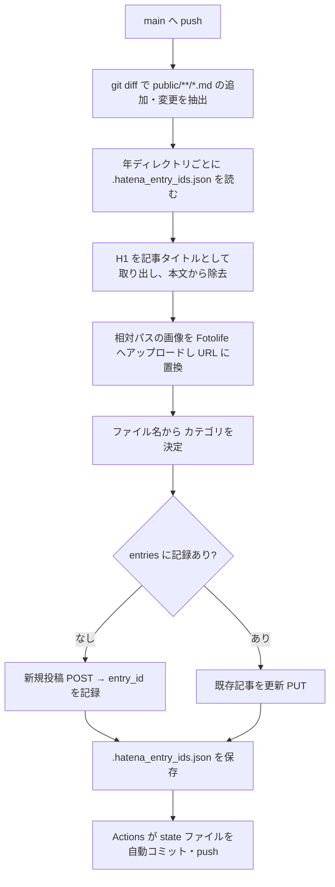

# はてなブログ自動投稿

`public/**/*.md` を `main` へ push すると、GitHub Actions（`.github/workflows/hatena-publish.yml`）が `scripts/hatena_publish.py` を実行し、はてなブログへ投稿・更新する。

## 動作の流れ



## 対象ファイルの決め方

`git diff {BEFORE_SHA}...{AFTER_SHA} --name-only --diff-filter=AM` の結果から、`public/` 配下の `.md` だけを拾う。

- Actions では `BEFORE_SHA` = `github.event.before`、`AFTER_SHA` = `github.sha`。
- 環境変数が無い場合は `HEAD~1...HEAD`（ローカル実行時の既定）。
- 削除（D）は対象外。**記事を消してもブログ側からは消えない**。

## 記事タイトルと本文

- 最初の `# ` 見出しが記事タイトルになる。H1 が無いと `ValueError`。
- 本文からは `# ` で始まる行が**すべて**除去される。Markdown の H1 は 1 記事に 1 つという前提なので通常は問題ないが、コードブロック中に `# ` 始まりの行があると一緒に消える点に注意。
- 投稿形式は `text/x-markdown`、下書きではなく即公開（`<app:draft>no</app:draft>`）。

## 画像

記事内の `` は、Fotolife にアップロードしたうえで URL に置換される。

- `http` で始まる URL はそのまま残る。
- `public/` の外を指す画像は置換されない（そのまま出力される）。
- ファイルが存在しない場合は `FileNotFoundError` で失敗する。
- 一度アップロードした画像は状態ファイルの `images` に記録され、次回以降は再アップロードせずに同じ URL を使う。
- Fotolife 側の `dc:subject`（フォルダ）は `KeibaAI` 固定。

## カテゴリ

`configs/hatena.yml` で、ファイル名（拡張子を除いた部分）ごとにカテゴリを決める。

```yaml
categories:
  default: [競馬]
  予想: [競馬, 競馬予想, G1予想]
  結果: [競馬, 競馬予想, G1回顧, G1結果]
```

一致するキーが無ければ `default` を使う。`default` も無ければ `KeyError`。`傾向.md` / `前日の傾向.md` は現状 `default`（`競馬`）で投稿される。

## 状態ファイル `.hatena_entry_ids.json`

投稿済みかどうかの判定に使う。**年ディレクトリごと**に置かれる（`public/2026/.hatena_entry_ids.json`）。

```json
{
  "entries": { "2026/2026061409030411_宝塚記念/予想.md": "エントリID" },
  "images":  { "2026/2026061409030411_宝塚記念/img/result/大雨.png": "https://cdn-ak.f.st-hatena.com/..." }
}
```

- キーは `public/` からの相対パス。
- Actions が投稿後にこのファイルを自動コミット・push する（コミットメッセージ `chore: update hatena entry ids`）。**作業を再開する前に `git pull` すること**。
- このファイルの `entries` を消すと、同じ記事がもう一度新規投稿されて重複する。
- 逆に、記事ファイルをリネーム・移動するとキーが変わるため、新規記事として投稿される。

## 認証

| 用途 | 方式 | 必要な Secrets |
| --- | --- | --- |
| 記事の投稿・更新（AtomPub） | Basic 認証 | `HATENA_ID` / `HATENA_BLOG_ID` / `HATENA_API_KEY` |
| 画像アップロード（Fotolife） | WSSE 認証 | `HATENA_ID` / `HATENA_API_KEY` |

## 失敗時の確認

| 症状 | 原因の候補 |
| --- | --- |
| `H1見出しが見つかりません` | 記事に `# ` 見出しが無い |
| `カテゴリ設定が見つかりません` | `configs/hatena.yml` に `default` が無い |
| `画像ファイルが存在しません` | 相対パスの綴り違い、画像を push し忘れ |
| `エントリ投稿失敗: 401` | Secrets の値（特に API キー）が誤っている |
| 記事が二重に投稿された | 状態ファイルが失われた／記事ファイルをリネームした |
| 何も投稿されない | 差分に `public/**/*.md` が含まれていない（`paths` フィルタで Actions 自体が起動しない） |
