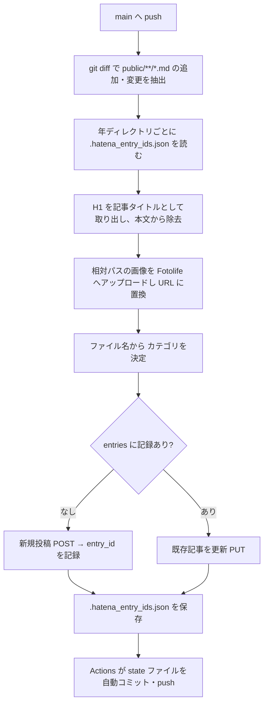

# はてなブログ自動投稿

`public/**/*.md` を `main` へ push すると、GitHub Actions（`.github/workflows/hatena-publish.yml`）が `scripts/hatena_publish.py` を実行し、はてなブログへ投稿・更新する。

## 動作の流れ


```mermaid
flowchart TD
    P[main へ push] --> D[git diff で public/**/*.md の追加・変更を抽出]
    D --> Y[年ディレクトリごとに .hatena_entry_ids.json を読む]
    Y --> T[H1 を記事タイトルとして取り出し、本文から除去]
    T --> I[相対パスの画像を Fotolife へアップロードし URL に置換]
    I --> C[ファイル名から カテゴリを決定]
    C --> E{entries に記録あり?}
    E -- なし --> POST[新規投稿 POST → entry_id を記録]
    E -- あり --> PUT[既存記事を更新 PUT]
    POST --> S[.hatena_entry_ids.json を保存]
    PUT --> S
    S --> B[Actions が state ファイルを自動コミット・push]
```

## 対象ファイルの決め方

`git diff {BEFORE_SHA}...{AFTER_SHA} --name-only --diff-filter=AM` の結果から、`public/` 配下の `.md` だけを拾う。

- Actions では `BEFORE_SHA` = `github.event.before`、`AFTER_SHA` = `github.sha`。
- 環境変数が無い場合は `HEAD~1...HEAD`（ローカル実行時の既定）。
- 削除（D）は対象外。**記事を消してもブログ側からは消えない**。

## 記事タイトルと本文

- 最初の `# ` 見出しが記事タイトルになる。H1 が無いと `ValueError`。
- 本文からは `# ` で始まる行が**すべて**除去される。Markdown の H1 は 1 記事に 1 つという前提なので通常は問題ないが、コードブロック中に `# ` 始まりの行があると一緒に消える点に注意。
- 投稿形式は `text/x-markdown`、下書きではなく即公開（`<app:draft>no</app:draft>`）。

## 画像

記事内の `` は、Fotolife にアップロードしたうえで URL に置換される。

- `http` で始まる URL はそのまま残る。
- `public/` の外を指す画像は置換されない（そのまま出力される）。
- ファイルが存在しない場合は `FileNotFoundError` で失敗する。
- 一度アップロードした画像は状態ファイルの `images` に記録され、次回以降は再アップロードせずに同じ URL を使う。
- Fotolife 側の `dc:subject`（フォルダ）は `KeibaAI` 固定。

## カテゴリ

`configs/hatena.yml` で、記事ファイルの置き場所とファイル名（拡張子を除いた部分）からカテゴリを決める。

```yaml
categories:
  default: [競馬]
  race: [競馬, G1]
  article:
    過去の傾向: [傾向分析]
    前日の傾向: [馬場傾向]
    当日の傾向: [馬場傾向]
    予想: [競馬予想]
    回顧: [レース回顧]
```

- 親ディレクトリ名が `{race_code}_{レース名}` 形式のレース記事には、`race` → `article` のファイル名に対応するカテゴリ → レース名の順にカテゴリを付ける（重複は1つにまとめる）。例: `public/2026/2026092706040911_スプリンターズS/予想.md` は `競馬` `G1` `競馬予想` `スプリンターズS`。
- レース記事以外（`public/馬券の印ルール.md` など）には `default` のカテゴリを付ける。
- レース記事で `article` に無いファイル名の場合や、必要なキーが無い場合は `KeyError` で失敗する。

## ブログURL

`configs/hatena.yml` の `blog_url` にブログのURLを書く。`gen_predict` と `gen_result` が、公開フィード（`{blog_url}/feed`）から関連記事のリンクを引くときに使う。

```yaml
blog_url: https://kubotech.hatenadiary.com
```

## 状態ファイル `.hatena_entry_ids.json`

投稿済みかどうかの判定に使う。**年ディレクトリごと**に置かれる（`public/2026/.hatena_entry_ids.json`）。

```json
{
  "entries": { "2026/2026061409030411_宝塚記念/予想.md": "エントリID" },
  "images":  { "2026/2026061409030411_宝塚記念/img/result/大雨.png": "https://cdn-ak.f.st-hatena.com/..." }
}
```

- キーは `public/` からの相対パス。
- Actions が投稿後にこのファイルを自動コミット・push する（コミットメッセージ `chore: update hatena entry ids`）。**作業を再開する前に `git pull` すること**。
- このファイルの `entries` を消すと、同じ記事がもう一度新規投稿されて重複する。
- 逆に、記事ファイルをリネーム・移動するとキーが変わるため、新規記事として投稿される。

## 関連記事のリンク

`gen_predict`（予想記事）と `gen_result`（回顧記事）は、同じレースの関連記事へのリンクを `## 関連記事` に入れる。リンクは次の順に引く。

1. 記事ファイルの `public/` からの相対パスで、状態ファイルの `entries` からエントリIDを引く。
2. 公開フィード（`{blog_url}/feed`）の1ページ目（最近の約30件）から、`<id>hatenablog://entry/{エントリID}</id>` が一致する `<entry>` を探し、タイトルと URL を取り出す。

状態ファイルに記事が無い（未投稿）場合や、フィードに該当のエントリが無い場合は、その記事のリンクは出力しない。フィードの取得に失敗した場合（通信エラー、HTTP エラー、XML の解析失敗）は例外で停止する。フィードは最近の記事しか載らないため、投稿から時間が経った記事のリンクは引けなくなる。

## 認証

| 用途 | 方式 | 必要な Secrets |
| --- | --- | --- |
| 記事の投稿・更新（AtomPub） | Basic 認証 | `HATENA_ID` / `HATENA_BLOG_ID` / `HATENA_API_KEY` |
| 画像アップロード（Fotolife） | WSSE 認証 | `HATENA_ID` / `HATENA_API_KEY` |

## 失敗時の確認

| 症状 | 原因の候補 |
| --- | --- |
| `H1見出しが見つかりません` | 記事に `# ` 見出しが無い |
| `カテゴリ設定が見つかりません` | レース記事のファイル名が `configs/hatena.yml` の `article` に無い、または `default` / `race` / `article` が無い |
| `画像ファイルが存在しません` | 相対パスの綴り違い、画像を push し忘れ |
| `エントリ投稿失敗: 401` | Secrets の値（特に API キー）が誤っている |
| 記事が二重に投稿された | 状態ファイルが失われた／記事ファイルをリネームした |
| 関連記事のリンクが入らない | 記事が未投稿、または投稿が古くフィードの1ページ目に載っていない |
| 何も投稿されない | 差分に `public/**/*.md` が含まれていない（`paths` フィルタで Actions 自体が起動しない） |
