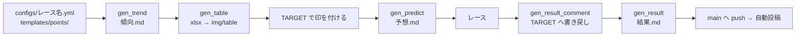

# レース1本分の作業手順

`race_code` を `2026061409030411`（2026年宝塚記念）とした場合の流れ。実際の成果物は `public/2026/2026061409030411_宝塚記念/` に残っているので、迷ったら実物を見るのが早い。



## 0. 事前準備（そのレースを初めて扱うとき）

- `configs/{レース名}.yml` を用意する → [config-reference.md](config-reference.md)
- `templates/points/{レース名}.md` にそのレースの狙い・格言を書く（`gen_predict` の `## ポイント` に流し込まれる）

## 1. 傾向分析（週の前半）

```bash
python -m scripts.gen_trend --race-code 2026061409030411
```

`public/2026/2026061409030411_宝塚記念/傾向.md` が生成される。ここから手で仕上げる。

- 各表の下に `> 一言コメント` を足す（引用記法で書くのが既存記事のスタイル）。
- 見出し直下に「※ 展開に関係する項目は開催4日目良馬場の21,22年のみを集計」のような集計方針の但し書きを足す。
- 使わない表は削る。`### 比較表` プレースホルダは手で埋めるか削除する。

## 2. 分析表（Excel）

```bash
python -m scripts.gen_table --race-code 2026061409030411
```

`table/{race_code}_{レース名}.xlsx` が生成される。色が付いたセルが多い馬＝条件に合う馬という見方をする。記事には Excel をそのまま貼らず、スクリーンショットを `img/table/01.png` のように保存して貼る。

## 3. 印を付ける

TARGET frontier JV 上で出走馬に印（◎○▲△◆☆注）を付ける。このリポジトリは印を**読むだけ**で、決めるのは人間の仕事。→ [tfjv-data.md](tfjv-data.md)

## 4. 予想記事（前日）

```bash
python -m scripts.gen_predict --race-code 2026061409030411
```

`予想.md` が生成される。中身は `## ポイント` / `## 前日の傾向` / `## 印` / `## 見解` / `## 買い目`。

- `## 見解` には、印を付けた馬の過去走コメント（TARGET に書き溜めたもの）が並ぶ。これを土台に読みを書き足す。
- `## 前日の傾向` を独立記事にする場合は、そのセクションを `前日の傾向.md` として切り出す（H1 は `# {レース名}{年}前日の傾向`）。
- 関連記事へのリンク（傾向分析・前日の傾向）は手で追加する。はてなの記事 URL は投稿後に確定するため、**先に傾向記事を公開してから URL を貼る**。
- **再実行すると上書きされる**ので、書き足し始めたら `gen_predict` は流し直さない。

## 5. レース後：結果コメントの書き戻し

```bash
python -m scripts.gen_result_comment --race-code 2026061409030411
```

TARGET の成績コメントファイルに `[宝塚記念] 0.3秒差2着。` のような定型文を追記する。これをやっておくと、次走以降の `gen_predict` の見解欄にその馬の戦績が自動で並ぶ。

TARGET 側で回顧コメントを手入力する運用でもよい。その場合はこのスクリプトを飛ばす。**追記専用なので二重実行しない**。

## 6. 結果記事

```bash
python -m scripts.gen_result --race-code 2026061409030411
```

`結果.md` が生成される。`## 結果`（3着まで）と `## 回顧`（各馬のコメント）が埋まった状態なので、`## 総評` を書き、レース当日の写真やパトロールビデオのキャプチャ（`img/result/`、`img/patrol/`）を貼って仕上げる。

## 7. 公開

`public/**/*.md` を `main` へ push すると、GitHub Actions が変更されたファイルをはてなブログへ投稿・更新する。

- 記事内の画像は**相対パス**（`img/result/大雨.png`）で書いておけば、投稿時に Fotolife へアップロードされて URL に置換される。
- 記事の H1 見出しがそのままブログ記事タイトルになる（本文からは除去される）。
- 投稿後、Actions が `.hatena_entry_ids.json` を自動コミットするので、**次の作業前に `git pull` する**。

詳細と失敗時の対処は [hatena-publish.md](hatena-publish.md)。

## 記事ファイルの命名規則

| ファイル名 | 用途 | はてなカテゴリ |
| --- | --- | --- |
| `傾向.md` | 傾向分析 | `競馬` |
| `前日の傾向.md` | 前日の馬場傾向 | `競馬` |
| `予想.md` | 予想 | `競馬` `競馬予想` `G1予想` |
| `結果.md` | 結果・回顧 | `競馬` `競馬予想` `G1回顧` `G1結果` |

カテゴリはファイル名（拡張子を除いた stem）で決まる。`configs/hatena.yml` に無いファイル名は `default` のカテゴリになる。
