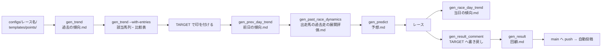

# レース1本分の作業手順

`race_code` を `2026061409030411`（2026年宝塚記念）とした場合の流れ。実際の成果物は `public/2026/2026061409030411_宝塚記念/` に残っているので、迷ったら実物を見るのが早い。


```mermaid
flowchart LR
    A[configs/レース名/<br/>templates/points/] --> B[gen_trend<br/>過去の傾向.md]
    B --> C[gen_trend --with-entries<br/>該当馬列・比較表]
    C --> D[TARGET で印を付ける]
    D --> P[gen_prev_day_trend<br/>前日の傾向.md]
    P --> Q[gen_past_race_dynamics<br/>出走馬の過去走の展開評価.md]
    Q --> E[gen_predict<br/>予想.md]
    E --> F[レース]
    F --> R[gen_race_day_trend<br/>当日の傾向.md]
    F --> G[gen_result_comment<br/>TARGET へ書き戻し]
    G --> H[gen_result<br/>回顧.md]
    H --> I[main へ push → 自動投稿]
```

## 0. 事前準備（そのレースを初めて扱うとき）

- `configs/{レース名}/trends.yml`（`configs/trends/` の項目名を並べる）と `table.yml`（比較表に載せる項目と色付けの基準）を用意する → [config-reference.md](config-reference.md)
- `templates/points/{レース名}.md` にそのレースの狙い・格言を見出し無しの本文で書く（`gen_predict` の `## ポイント` 見出しの下に流し込まれる）

## 1. 傾向分析（週の前半）

```bash
python -m scripts.gen_trend --race-code 2026061409030411
```

`public/2026/2026061409030411_宝塚記念/過去の傾向.md` が生成される。ここから手で仕上げる。

- 各表の下に `> 一言コメント` を足す（引用記法で書くのが既存記事のスタイル）。
- 使わない表は削る。

## 2. 出走馬の比較表（出馬表の確定後）

```bash
python -m scripts.gen_trend --race-code 2026061409030411 --with-entries
```

同じ `過去の傾向.md` が上書きされ、各表の右端に今回の出走馬のうちその行に当たる馬の馬番（「該当馬」列）が入る。`table.yml` に項目があるカテゴリの末尾には、出走馬の比較表の画像（`img/trend_table/{カテゴリ名}.png`）が付く。色が付いたセルが多い馬＝条件に合う馬という見方をする。

手で足した一言コメントは再実行で失われるため、出馬表の確定を待ってから `--with-entries` で生成し直し、その後にコメントを書くとよい。

## 3. 印を付ける

TARGET frontier JV 上で出走馬に印（◎○▲△◆☆注）を付ける。このリポジトリは印を**読むだけ**で、決めるのは人間の仕事。→ [tfjv-data.md](tfjv-data.md)

## 4. 前日の傾向（前日の全レース終了後）

```bash
python -m scripts.gen_prev_day_trend --race-code 2026061409030411
```

`前日の傾向.md` が生成される。前日に同じ競馬場・同じ芝ダで行われた平地レースの出目（人気・枠番・脚質・上がり順位）と、各レースの上位3頭が並ぶ。

- 馬場がどちらに振れているか（内前が残るのか外差しが決まるのか）の所感を書き足す。
- 予想記事から参照するので、**予想記事より先に公開して URL を確定させる**。

## 5. 出走馬の過去走の展開評価（出馬表の確定後）

```bash
python -m scripts.gen_past_race_dynamics --race-code 2026061409030411
```

`出走馬の過去走の展開評価.md` が生成される。冒頭に出走馬の過去走の展開評価値の平均値のランキング（棒グラフ）が載り、続けて出走馬を馬番順に並べ、馬ごとに過去走の展開評価値の折れ線グラフと、折りたたみの中へ、中央の平地で出走した直近5走の展開評価（有利度の表・標準化散布図・展開評価値の棒グラフ）が載る。過去走の標準化散布図と棒グラフは `img/past_dynamics/` に保存される。

- 出走馬の過去走を見比べ、展開に恵まれた走と不利をはね返した走を読み取る材料にする。
- 同じ過去走に今回の他の出走馬が出ていれば、展開評価値の棒グラフでその馬の棒が3色目（黄）になり、馬名が太字になる。

## 6. 予想記事（前日）

```bash
python -m scripts.gen_predict --race-code 2026061409030411
```

`予想.md` が生成される。中身は `## ポイント` / `## 関連記事` / `## 印` / `## 見解` / `## 買い目`。

- `## 見解` には、印を付けた馬の過去走コメント（TARGET に書き溜めたもの）が並ぶ。これを土台に読みを書き足す。
- `## 関連記事` には、投稿済みの過去の傾向・前日の傾向・当日の傾向の記事へのリンクが自動で入る。はてなの記事 URL は投稿後に確定するため、**先にそれらを公開してから `gen_predict` を実行する**。最後の `[自作AIの予想]()` は常に出力されるので、自作AIの予想記事を公開したあとに URL を手で埋める。
- **再実行すると上書きされる**ので、書き足し始めたら `gen_predict` は流し直さない。

## 7. 当日の傾向（当日のレースの結果が出た後）

```bash
python -m scripts.gen_race_day_trend --race-code 2026061409030411
```

`当日の傾向.md` が生成される。対象レースと同じ日・同じ競馬場・同じ芝ダの平地レースのうち、対象レースより前に行われて結果が出ているものだけを集計する。構成は前日の傾向と同じで、画像は `img/race_day/` に保存される。

- 結果が出ているレースが1つも無い場合は、タイトルだけの記事になる。
- 結果が出るたびに集計対象のレースが増えるので、最終的な記事にしたい時点で流し直す。

## 8. レース後：結果コメントの書き戻し

```bash
python -m scripts.gen_result_comment --race-code 2026061409030411
```

TARGET の成績コメントファイルに `[宝塚記念] 0.3秒差2着。` のような定型文を追記する。これをやっておくと、次走以降の `gen_predict` の見解欄にその馬の戦績が自動で並ぶ。

TARGET 側で回顧コメントを手入力する運用でもよい。その場合はこのスクリプトを飛ばす。**追記専用なので二重実行しない**。

## 9. 結果記事

```bash
python -m scripts.gen_result --race-code 2026061409030411
```

`回顧.md` が生成される。`## 結果`（3着までの表）、`## 関連記事`（予想記事へのリンク）、`## 展開評価`（展開の有利度、標準化散布図、全馬の展開評価値の棒グラフ。画像は `img/race_result/` に保存される）、`## 回顧`（各馬のコメント）が埋まった状態なので、`## 総評` を書き、レース当日の写真やパトロールビデオのキャプチャ（`img/result/`、`img/patrol/`）を貼って仕上げる。`## 関連記事` の `[自作AIの結果]()` は、URL を手で埋める。

## 10. 公開

`public/**/*.md` を `main` へ push すると、GitHub Actions が変更されたファイルをはてなブログへ投稿・更新する。

- 記事内の画像は**相対パス**（`img/result/大雨.png`）で書いておけば、投稿時に Fotolife へアップロードされて URL に置換される。
- 記事の H1 見出しがそのままブログ記事タイトルになる（本文からは除去される）。
- 投稿後、Actions が `.hatena_entry_ids.json` を自動コミットするので、**次の作業前に `git pull` する**。

詳細と失敗時の対処は [hatena-publish.md](hatena-publish.md)。

## 記事ファイルの命名規則

| ファイル名 | 用途 | はてなカテゴリ |
| --- | --- | --- |
| `過去の傾向.md` | 傾向分析 | `競馬` `G1` `傾向分析` レース名 |
| `前日の傾向.md` | 前日の馬場傾向 | `競馬` `G1` `馬場傾向` レース名 |
| `当日の傾向.md` | 当日の馬場傾向 | `競馬` `G1` `馬場傾向` レース名 |
| `出走馬の過去走の展開評価.md` | 出走馬の過去走の展開評価 | `競馬` `G1` `展開評価` レース名 |
| `予想.md` | 予想 | `競馬` `G1` `競馬予想` レース名 |
| `回顧.md` | 結果・回顧 | `競馬` `G1` `レース回顧` レース名 |

カテゴリは `configs/hatena.yml` の設定とファイル名（拡張子を除いた stem）で決まり、ディレクトリ名のレース名（例: `スプリンターズS`）も付く。レース記事のディレクトリに上記以外のファイル名の md を置くと、投稿時に `KeyError` で失敗する。
