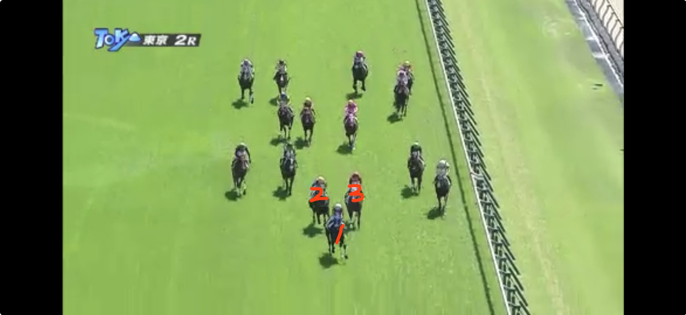
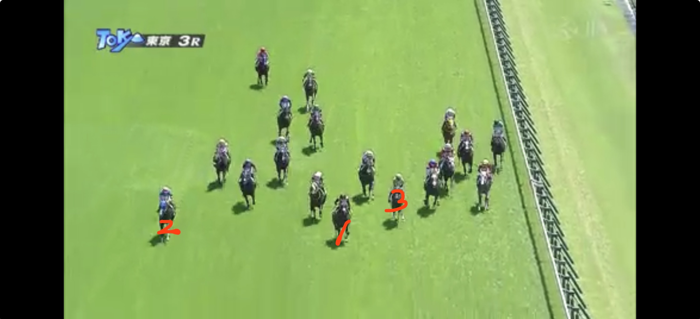
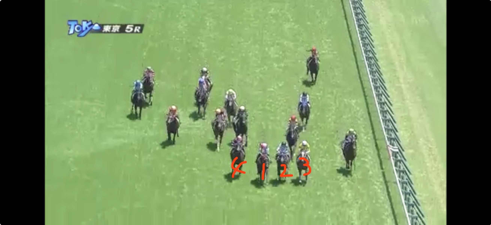
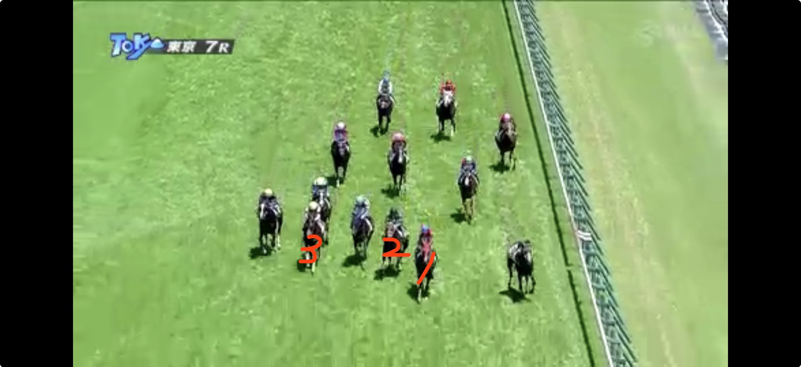
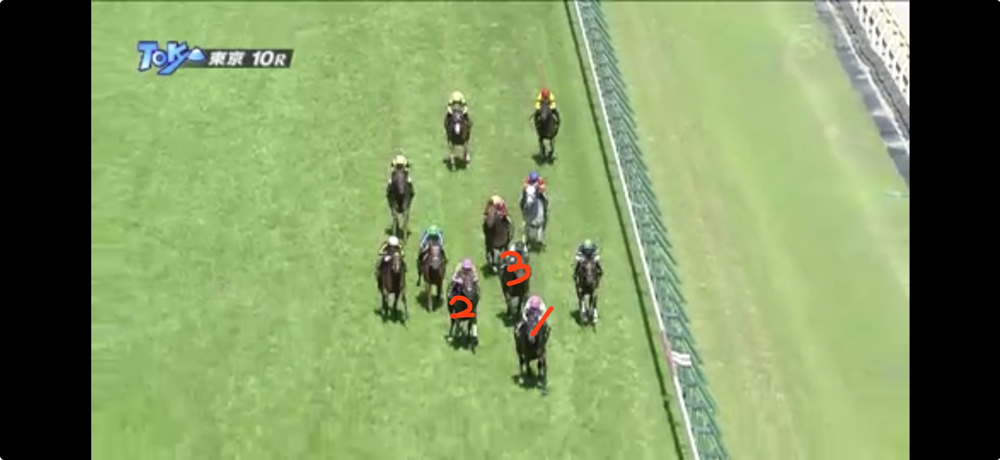
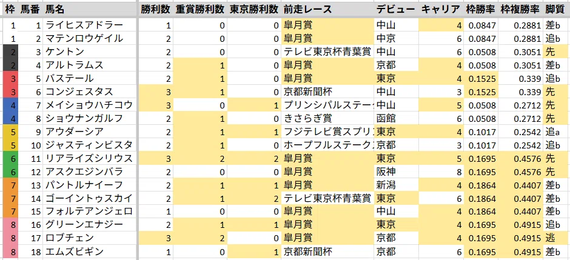
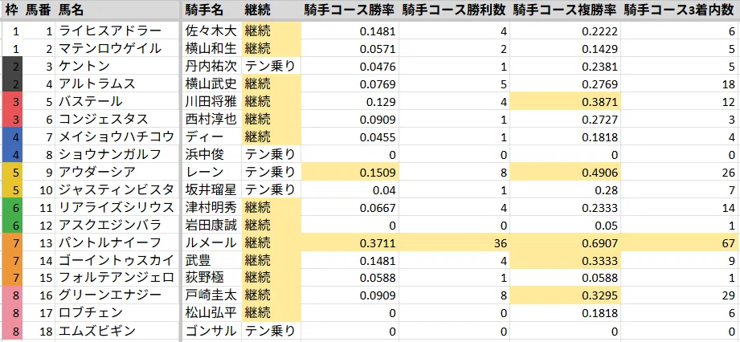
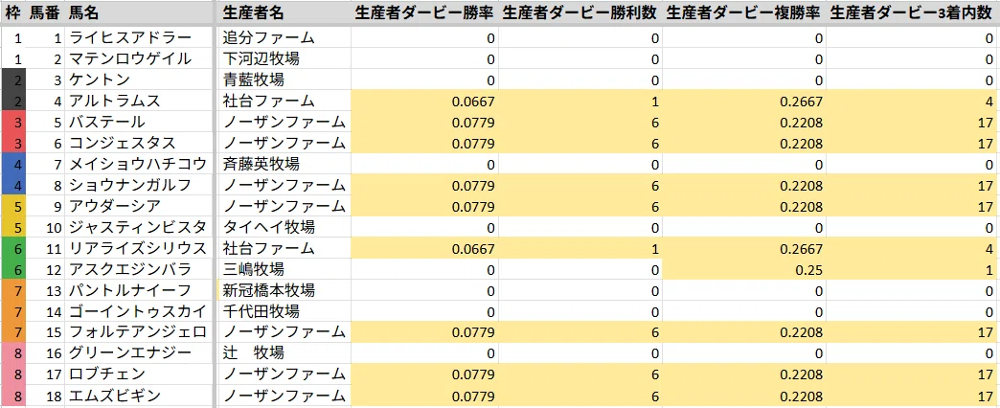
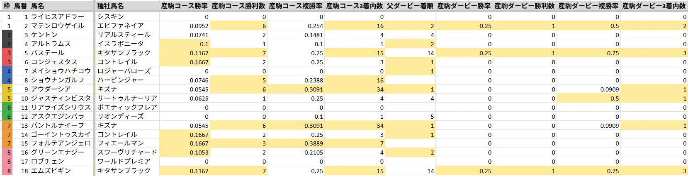

# 東京優駿2026

自作AIの予想は[こちら](https://keibaai-41790.web.app/2026%E5%B9%B4/5%E6%9C%88/05-31/%E6%9D%B1%E4%BA%AC/%E6%9D%B1%E4%BA%AC11R_%E6%97%A5%E6%9C%AC%E3%83%80%E3%83%BC%E3%83%93%E3%83%BC.html)  
この記事はAIの予想とは一切関係なく、人間が真剣に考えています。

## ポイント

- Cコース替わりで内前有利
- 前走皐月賞組が圧倒的（5着以内or5人気以内）
  - 過去10年馬券になった30頭のうち24頭が前走皐月賞
  - ただし99年以降皐月賞6着以下かつ6人気以下で馬券になった馬はいない

**主要な格言**
- ダービー馬はダービー馬から
  - 22年以降は崩れている。
- 乗り替わりでダービーは勝てない（86年以降2頭のみ）
  - 21年シャフリヤール（福永）
  - 23年タスティエーラ（レーン）※テン乗り
- 重賞未勝利はダービーで勝てない（86年以降3頭のみ）
  - 89年ウィナーズサークル
  - 96年フサイチコンコルド
  - 19年ロジャーバローズ
- 青葉賞組はダービーで勝てない
  - 例外なし

## 前日の傾向

> Cコース替わりも最内は微妙。道中は内から2列目を先行、直線は真ん中を走るのがベスト

### 出目

3着以内に入った頭数

**人気**
| 1人気 | 2人気 | 3人気 | 4-6人気 | 7-9人気 | 10人気以下 |
| --- | --- | --- | --- | --- | --- |
| 3頭 | 5頭 | 3頭 | 2頭 | 0頭 | 2頭 |

**枠番**
| 1枠 | 2枠 | 3枠 | 4枠 | 5枠 | 6枠 | 7枠 | 8枠 |
| --- | --- | --- | --- | --- | --- | --- | --- |
| 2頭 | 4頭 | 1頭 | 1頭 | 0頭 | 1頭 | 2頭 | 4頭 |

**脚質**
| 逃げ | 先行 | 差し | 追込 |
| --- | --- | --- | --- |
| 0頭 | 8頭 | 5頭 | 2頭 |

**上がり順位**
| 1位 | 2位 | 3位 | 4-6位 | 7-9位 | 10位以下 |
| --- | --- | --- | --- | --- | --- |
| 4頭 | 0頭 | 2頭 | 5頭 | 2頭 | 2頭 |

### 東京2R 未勝利 2400m 16頭

| 着順 | 枠 | 馬番 | 人気 | 4角通過順位 | 後3ハロン | 後3ハロン順位 |
| --- | --- | --- | --- | --- | --- | --- |
| 1着 | 1枠 | 2番 | 2人気 | 4番手 | 34.7秒 | 5位 |
| 2着 | 7枠 | 14番 | 11人気 | 8番手 | 34.4秒 | 1位 |
| 3着 | 3枠 | 6番 | 3人気 | 8番手 | 34.4秒 | 1位 |

### 東京3R 未勝利 1400m 18頭

| 着順 | 枠 | 馬番 | 人気 | 4角通過順位 | 後3ハロン | 後3ハロン順位 |
| --- | --- | --- | --- | --- | --- | --- |
| 1着 | 2枠 | 4番 | 1人気 | 1番手 | 34.5秒 | 10位 |
| 2着 | 8枠 | 18番 | 2人気 | 14番手 | 33.2秒 | 1位 |
| 3着 | 6枠 | 12番 | 13人気 | 4番手 | 34.4秒 | 8位 |

### 東京5R 未勝利 2000m 16頭

| 着順 | 枠 | 馬番 | 人気 | 4角通過順位 | 後3ハロン | 後3ハロン順位 |
| --- | --- | --- | --- | --- | --- | --- |
| 1着 | 8枠 | 16番 | 3人気 | 7番手 | 33.8秒 | 4位 |
| 2着 | 2枠 | 4番 | 2人気 | 3番手 | 34.2秒 | 8位 |
| 3着 | 1枠 | 2番 | 1人気 | 3番手 | 34.3秒 | 10位 |

### 東京7R 1勝クラス 1400m 13頭

| 着順 | 枠 | 馬番 | 人気 | 4角通過順位 | 後3ハロン | 後3ハロン順位 |
| --- | --- | --- | --- | --- | --- | --- |
| 1着 | 4枠 | 4番 | 5人気 | 4番手 | 34.2秒 | 3位 |
| 2着 | 2枠 | 2番 | 1人気 | 9番手 | 33.8秒 | 1位 |
| 3着 | 7枠 | 11番 | 2人気 | 6番手 | 34.3秒 | 4位 |

### 東京10R 2勝クラス(特別) 1600m 11頭

| 着順 | 枠 | 馬番 | 人気 | 4角通過順位 | 後3ハロン | 後3ハロン順位 |
| --- | --- | --- | --- | --- | --- | --- |
| 1着 | 8枠 | 10番 | 2人気 | 2番手 | 33.3秒 | 4位 |
| 2着 | 8枠 | 11番 | 4人気 | 3番手 | 33.3秒 | 4位 |
| 3着 | 2枠 | 2番 | 3人気 | 5番手 | 33.2秒 | 3位 |

## 比較表

### 出走馬

> 3勝以上、重賞勝利、前走皐月賞、東京適性ありが優勢

- リアライズシリウス
- ロブチェン

- **勝利数**: 過去1着になった回数
  - 90年以降の馬券内108頭中76頭が出走時点で3勝以上だった馬
  - 76頭のうち56頭が前走G1
- **重賞勝利数**: 過去重賞で1着になった回数
  - 86年以降重賞未勝利でダービーを勝った馬は3頭のみ。近年では19年ロジャーバローズのみ。
- **東京勝利数**: 過去東京で1着になった回数
- **前走レース**: 前走のレース名
  - 過去10年前走皐月賞8-10-6-76
- **デビュー**: デビュー戦の競馬場
  - 92年以降中山デビューで馬券内は2頭のみ（稍重・重）
  - 近年ではファンダムやシックスペンスが中山デビューで14着9着と惨敗
  - ダービー狙ってて関東圏でわざわざデビューさせるのであれば中山ではなく東京使うのが普通
- **キャリア**: これまでの出走回数
  - 過去10年キャリア7戦以上は0-0-0-30
- **枠勝率**: 過去5年東京芝2400mCコース初週の該当枠の勝率
- **枠複勝率**: 過去5年東京芝2400mCコース初週の該当枠の複勝率
- **脚質**: [脚質の決定と位置取りの分析](http://www.keiba-lab.jp/exp/up/d_1106.html)をもとに判定。過去レースの脚質で出現回数最多の脚質を表示。

### 騎手

> ルメールが圧倒的、継続騎乗から入るのが基本

- パントルナイーフ

- **継続**: 継続騎乗、乗り戻り、テン乗りのいずれか
  - 86年以降、乗り替わりでダービーを勝ったのは2頭のみ
- **騎手コース勝率/勝利数**: 過去5年東京芝2400mの騎手の勝率/勝利数
- **騎手コース複勝率/3着内数**: 過去5年東京芝2400mの騎手の複勝率/3着内数

### 生産者

> ノーザン、社台が圧倒的

- ノーザン: 5,6,8,9,15,17,18
- 社台: 4,11
- 社台系: 1

- **生産者ダービー勝率/勝利数**: 過去10年のダービーでの生産者の勝率/勝利数
- **生産者ダービー複勝率/3着内数**: 過去10年のダービーでの生産者の複勝率/3着内数

### 血統

> 近年はエピファネイア、キタサンブラックが優勢

- マテンロウゲイル（エピファネイア）
- バステール（キタサンブラック）
- エムズギビン（キタサンブラック）

- **産駒コース勝率/勝利数**: 過去5年東京芝2400m良馬場の産駒の勝率/勝利数
- **産駒コース複勝率/3着内数**: 過去5年東京芝2400m良馬場の産駒の複勝率/3着内数
- **父ダービー着順**: 父のダービーでの着順
- **産駒ダービー勝率/勝利数**: 過去10年のダービーでの産駒の勝率/勝利数
- **産駒ダービー複勝率/3着内数**: 過去10年のダービーでの産駒の複勝率/3着内数

## 印

◎17ロブチェン  
○11リアライズシリウス  
▲15フォルテアンジェロ  
▲13パントルナイーフ  
△1ライヒスアドラー  
△16グリーンエナジー  
◆14ゴーイントゥスカイ  
◆2マテンロウゲイル  
◆9アウダーシア  
◆12アスクエジンバラ  
☆10ジャスティンビスタ  
注6コンジェスタス  
注5バステール  

## 見解

### ◎17ロブチェン

前走G1皐月賞0.2秒差1着。勝ちタイム1:56.5はコースレコード。周りが誰も逃げないので仕方なく逃げる。実は近3走で逃げていた馬はロブチェンしかいなかった。最初の直線で落鉄あり。前半1000mは58.9だが勝ちタイムを考えるとSペースで、ラスト6F11秒台を刻み続けて後続の脚を削った。直線ではリアライズシリウスに一度差されるも差し返す根性あり。展開向いたがそれにしても強かった。先行できるし高速馬場も重馬場もいけるしワールドプレミア産駒なので距離延長も問題なし。ここで逃げてしまった分今回折り合いがつくかどうかが課題となる。  
前々走G3共同通信杯ロケットスタートも控えて4番手。初の左回り・初の関東遠征・初の1800m・初の決め手勝負と初物尽くしだったが難なく対応してハイレベルメンバー相手に3着は高く評価する必要がある。  
3走前G1ホープフルS0.1秒差1着。道中は最内で脚を溜め、直線では空いたところから外に出し4角7番手から上がり最速で差し切り。  

既にG1を2勝。当然能力は最上位。
大外はイクイノックスでも負ける不利な枠なのは間違いないが、おかげで逃げることにならなそうなのは良い。出足が良いので2-4番手あたりを追走し、直線では5頭分くらい外に出してそこそこの上がりを使ってリアライズシリウスを差し切る姿が目に浮かぶ。  
東京適性はリアライズシリウスには劣るが、皐月賞前に共同通信杯を使ってくるあたりしっかりダービーまで見据えていて好感が持てる。レコード決着をタイム差なし3着に来れているので世代限定戦であれば能力でカバーできそう。  

過去10年東京芝出走歴がある皐月賞馬は1-3-1-1  
皐月賞で0.2秒差以上つけて勝利した馬は1-4-1-0  
前走皐月賞×継続騎乗×前走3番人気以内で3着以内×ノーザンファーム生産馬は3-5-0-0  
東京芝1800＋中山芝2000実績を両方満たした馬は5-5-3-2  
と強調材料は十分。

不安材料は皐月賞レコードの反動。  
00年以降、勝ち時計が1分58秒9以下だった皐月賞馬は日本ダービー1-1-1-7。対して1分59秒0以上だった年の皐月賞馬は4-5-1-3で、高速決着の皐月賞はダービーに直結しないといわれる。  
馬券内の3頭はダービーまでに東京で2勝以上かつ皐月賞を控える形で勝っており、ロブチェンは該当しない。

### ○11リアライズシリウス

自認マスカレードボール。  
前走G1皐月賞0.2秒差2着。2番手先行し高速馬場とロブチェンが作った前有利の展開が向いたとはいえ、道中は2頭目外を回っていたのとゲートがいいわけではなかったのに外枠から先行したことを考えると強い競馬だった。  
前々走G3共同通信杯勝ちタイム1.45.5はマスボの1.46.0を0.5秒更新するレースレコード。展開ドンピシャも改めて朝日杯のレベルの高さを証明した。  
3走前G1朝日杯4着と0.5秒差5着。気性難でゲートかなり嫌がる。4番手先行も外枠から終始2,3頭分外を回るロスがあった。差し有利展開も合わず、右回りも合わず、それでも5着に来るのだから十分強かった。  

今回は2戦2勝の東京。左回りの重賞も2勝しており前走よりも明らかに舞台は向いている。  
過去10年、東京芝1800＋中山芝2000実績を両方満たした馬は5-5-3-2と好成績。  
他に先行馬も少なく、ロブチェンが大外枠に入ったことで皐月賞とは立場が逆転。スムーズに先行して持続力勝負に持ち込めば展開も向きそう。  
ただし東京芝2400mはパンサラッサでも逃げ切れない舞台であり、逃げ切り勝ちできるイメージは全く湧かない。皐月賞のように内枠の馬が誰も主張しなかった場合逃げることになりそうなのは不安。誰か内枠の人気薄が色気出して爆逃げしてくれ。  
津村が土曜に落馬して万全ではなさそうなのは大きなマイナス。

以下、Twitterで見た不安材料と言い訳。  

> ポエティックフレアの産駒芝2200m以上0-0-0-4。  
父のサドラーズウェルズ系全体を見ても、ダービーでの成績は1-0-1-13。勝利は2006年のメイショウサムソンのみ。  

ポエティックフレアはまだ2年目の新種牡馬で、サンプルがかなり少ないことには注意が必要。  

> 東京芝1800m重賞を上がり3F4位以下で馬券内になった馬は0-0-0-7。  
3番人気ファントムシーフやタイトルホルダー、サトノシャイニングもこれに該当。

そもそも内前有利のレースで上がり最速が馬券に絡んだのは2019年が最後。オークスと違い上がり性能が問われるレースではない。  
サトノシャイニングは大外枠から消耗、ファントムシーフは4角9番手からでは届かない、タイトルホルダーは当時8人気でその時点では実力不足と言い訳させていただく。

> 共同通信杯過去10年でラスト1F 11.8秒は歴代最遅タイ。  
同タイムのダノンベルーガの年は道悪、その次に遅いダーリントンホールの年も雨の影響で時計を要する馬場。最後は完全に脚が上がっていた。

マスカレードボールのレコードを0.5秒も更新するレースを先行したんだから最後の1Fが遅くなっても仕方ない。

> 前走ロブチェンを差せなかったのも脚が上がってしまったからで、皐月賞のラスト1Fの個別ラップは下から6番目。

ロブチェンは2枠4番からスムーズ、リアライズシリウスは7枠15番から外目を回すロスがあった。

Twitterではめちゃくちゃリアライズシリウスの不安点が回ってくるのに、人気は普通にあるのはなぜなのか。

### ▲15フォルテアンジェロ

前走G1皐月賞0.5秒差5着。痛恨の出遅れで13番手から上がり最速33.4秒で5着まで。出遅れた分最内をロスなく回れていたのは展開向いたが、今までは先行脚質で、出遅れなければアスクエジンバラと同等の位置は取れていたはず。出遅れで0.5秒くらいは損していそうなので、ロブチェンとの差はオッズほどはないと思われる。  
前々走G1ホープフルSロブチェンと0.1秒差2着。4番手先行も道中は2,3頭分外を回される。直線では前が詰まり追い出しを待たされるロスも上がり3位で2着まで。ロブチェンも直線ではロスがあり後ろにいて上がりで0.4秒差付けられていることを考えると差はありそうだが十分強いといっていい。  

前走は出遅れたがそれ以外は先行できており、今の馬場で外枠から先行できれば展開向きそう。  
年明け初戦で皐月賞に出走して5着以内だった馬の日本ダービー成績3-2-0-1-0という謎の強調データもある。

前走皐月賞5着以内のノーザンなので安心感がある。  
東京も経験しているが、デビューが中山なのは気になる。  
1勝馬で重賞も未勝利なので、アタマまではきついか。

### ▲13パントルナイーフ

自認イクイノックス。  
前走G1皐月賞は1.3秒差14着。道中も11番手と既に物理的に届かない位置にいたが、4角でアルトラムスが下がってきたことにより巻き込まれて17番手まで下がってしまう不利を受け度外視可能。  
前々走G2東スポ2歳Sはアタマ差1着。後半4F45.0秒はクロワデュノール45.9秒イクイノックス45.9秒コントレイル45.7秒を抑えて過去最速。ただし超高速馬場だったことは加味必要。3角は7番手だったが4角では4番手まで上げており、上がり2位32.9秒も優秀。  

東京芝2400mのルメールは昨年6月以降4-8-4-1と圧倒的。  
弥生賞をフレグモーネ発症で回避し万全の状態ではなかった皐月賞で明らかな不利があって大敗した馬を、ルメールが選んで想定2桁人気なら買うしかないと思っていたが現在4番人気。そうですか…。

過去20年皐月賞4番人気以下で10着以下は0-0-0-56  
99年以降皐月賞6着以下or6人気以下で馬券になった馬はいない  
ルメールなら破れるだろうか。

先行できるかは怪しいが、4角1桁番手なら差しも間に合いそう。  

### △1ライヒスアドラー

前走G1皐月賞は2着と0.1秒差の3着。道中は3頭外を追走し、前有利の中上がり3位で8番手から3着まで持ってきており最も強い競馬だった。  
前々走G2弥生賞終始アドマイヤクワッズの後ろでマークして最後は差し切ったが2着まで。  
3走前G2東スポ2歳Sは0.2秒差3着。終始内を立ち回って直線もインを突くロスのない競馬。上がり2位32.9秒も上位2頭が3角から4角で順位を上げたのに対して4番手から6番手に下がったのが響いたか。  

内前有利の皐月賞外回し組。  
過去10年皐月賞で馬券内かつ上がり33.9秒以内の馬はマスカレードボール2着、ドウデュース1着、マカヒキ1着の2-1-0-0。  
皐月賞で初角10番手以下から馬券内3-2-2-3  
と強調材料あり。  
皐月賞強い内容で3着なのにこの人気はおいしい。

内枠有利のダービーで穴をあけがちな1枠をゲットし、内から脚を溜めてイン差しができそう。  
ただし23年以降1枠1番がゲート3頭空けから1頭空けに変わったことで、以前までより有利とは言えずむしろ初角でごちゃつくリスクがあることには注意が必要。

馬および騎手の折り合いも不安。  
佐々木大輔は先週同期の今村聖奈がオークス勝ったことでかかってる可能性がある。  
東京の直線は長いので早仕掛けしないで欲しい。

### △16グリーンエナジー

自認レガレイラ。  
前走G1皐月賞上がり2位33.6秒で0.5秒差7着。外枠から終始後方の外を回り、4角ではさらに外を回して10番手まで上げるも差し届かず。見事にレガレイラ。戸崎はダービーを見据えて折り合いに専念し無理をさせなかったらしい。  
前々走G3京成杯最内をうまく回ったとはいえ2,3番手がそのまま2,3着になるレースで後方から上がり最速差し切り勝ち。ダノンデサイルより時計は1.2秒、上3Fは0.3秒速い決着で強かった。  

ダービー最有力候補も熱発で1週前追切を中止。  
出走するかどうかも怪しかったが出るらしい。  
どう考えても体調は万全ではないはずだが最終追切では自己ベストを更新。なんでやねん。  
万全ではないとはいえダービーは絶好の舞台であり、想定2,3番人気の馬が10番人気で買えるならおいしい。

脚質的に4角2桁番手になりそうで、それだと今の馬場では届かなそうなのが懸念。

### ◆14ゴーイントゥスカイ

前走G2青葉賞0.1秒差1着。差し有利を4角7番手から上がり3位33.4秒で差し切り。やや展開向いた。  
前々走G3きさらぎ賞は0.3秒差6着。スローの上がり勝負で外から差すレースでは厳しかった。  
3走前G3京都2歳Sは0.2秒差3着。上がり2位35.2秒でやや差し有利の展開向いたが、1,2角で10番手だったところを外に出し4角では大外ぶん回しで5番手に上がった分の負荷は上位2頭に比べてあった。  

青葉賞組は人気馬もいたがダービー勝利はなし。  
過去10年だと前走青葉賞は0-0-2-18  
ただし今年の青葉賞の勝ちタイム2:23.0は歴代最速タイで、ダービーの歴代4位相当。  
また今年から青葉賞は中3週から中4週になっており、間隔に余裕が出てきている。

武豊の日本ダービーは乗り替わりだと0-0-1-10だが継続騎乗だと6-3-1-15。  
さらに継続騎乗で単勝3番人気以内だと6-2-1-3と好相性。

東京で2勝しているのはリアライズシリウスとゴーイントゥスカイだけで東京適性は言うまでもない。

### ◆2マテンロウゲイル

前走G1皐月賞1.0秒差10着。3角時点で17番手で4角外回して10番手まで上げてから上がり3位33.8も届かず。この高速馬場でここまで後ろにいると物理的に届かないので度外視。  
前々走L若葉S0.4秒差レースレコードで圧勝。  
3走前G3京成杯は前有利を3番手で先行したので展開向いた。グリーンエナジーとタイム差なしなのは良い。  
4走前未勝利戦はギャラボーグとタイム差無し2着  

こちらも内前有利の皐月賞外回し組。  
今回内枠を引けたことでライヒスアドラー同様イン差しに期待できる。  
ただし能力は1枚下だと思っており展開の助けが必要。  
過去20年皐月賞4番人気以下で10着以下0-0-0-56の不安データにも該当。  
とはいえオッズ付きすぎでは。

### ◆12アスクエジンバラ

前走G1皐月賞3着とクビ差4着。前有利を3番手で運び展開向いた。この展開でライヒスアドラーに差されるのは不満が残る。  
前々走G2スプリングSは差し展開向いて10番手から上がり3位のクビ差2着。  
3走前G1ホープフルSはロブチェンと0.2秒差3着。4番手先行も道中は3頭分外を回される。直線はスムーズに加速し上がり3位も進路をかえるロスのあったフォルテアンジェロとロブチェンには差されてしまった。  
4走前G3京都2歳Sは0.1秒差2着。4角5番手から上がり2位35.2秒も差される。直線で前が空かず内に切り替えた分のロスがあった。  

鞍上岩田パパが先々週落馬負傷し骨折したらしいが、ダービーに真剣すぎて騎乗するらしい。  
熱意は買うが、ダービーがなければ函館まで休むと言っていたので普通に考えて万全なわけがない。

外目から先行できそうなのは良い。

### ◆9アウダーシア

前走G2スプリングSクビ差1着。クレパスキュラーの捲りでハイペースになったところを最後方から津村の大外ぶん回しで上がり最速勝利。差し展開向いた。  

血統のことはよくわからないが東京2400mでトニービン持ちは嬉しい。  
鞍上レーンなのは良いが、テン乗りはもちろんマイナス。

### ☆10ジャスティンビスタ

前走G1ホープフルS0.7秒差8着。Sペースの瞬発力勝負を4角13番手から大外ぶん回しでは上がり2位34.6秒でも届かなかった。  
前々走G3京都2歳Sは0.1秒差1着。4角8番手から直線で外に出し上がり最速35.0秒で差し切り。やや外差しの展開向いたがラスト1ハロンは1頭だけものが違った。  

このときの2着は皐月賞4着のアスクエジンバラ、3着は青葉賞勝ちのゴーイントゥスカイだったことを考えると、このメンバーでもやれてもおかしくなく、ホープフルでの不利を考えれば14番人気はかなり美味しく見える。

骨折空けで万全かどうかわからないが、ワンチャンあっても。

瑠星はダービー当日が誕生日。ダービー騎乗機会は落馬→4着→3着→2着なので、当然次は1着で最高の誕生日プレゼントが渡されるはず。

なお過去10年前走皐月賞以外の重賞で3着以下は0-0-0-19と馬券内なし。

### 注6コンジェスタス

前走G2京都新聞杯クビ差1着。1000m58.7秒の差し有利を4角7番手から上がり最速35.3秒で差し切り。べレシートに勝ったのは評価できるが、展開利はこちらにあった。  

強いのかもしれないが、京都新聞杯は中2週で感覚詰まるのがきついし、わざわざ本命にするような馬ではないと思う。

### 注5バステール

前走G1皐月賞1.0秒差11着。大外枠から道中は最後方、4角も17番手で上がり2位33.6も物理的に届かない。  
前々走G2弥生賞アドマイヤクワッズは意識せず自分の競馬。8番手から上がり最速で差し切り。直線入ったところで接触の不利あるも展開はやや向いた。  

過去20年皐月賞4番人気以下で10着以下は0-0-0-56  
99年以降皐月賞6着以下or6人気以下で馬券になった馬はいない  

川田も成長を長い目で期待しているようで、前走は会見でバステールのストロングポイントを聞かれて「そう言われると難しいですね…」と回答。  
菊花賞ではワンチャン。

## 買い目

◎3倍付くなら考えたが無理そう。  
○は前日の落馬で人気落として3人気になりそう。  
あまり勝ち切るイメージはないが、ロブチェン以外に誰が勝つかも想像つかないので単勝は○で。  
馬連は○▲来なかったとき用で△のみ  
注を買う資金は余らなかったので消し。

単勝○  
3連複◎-○▲-○▲△◆☆  
馬連◎-△  

## 結果

## 回顧
