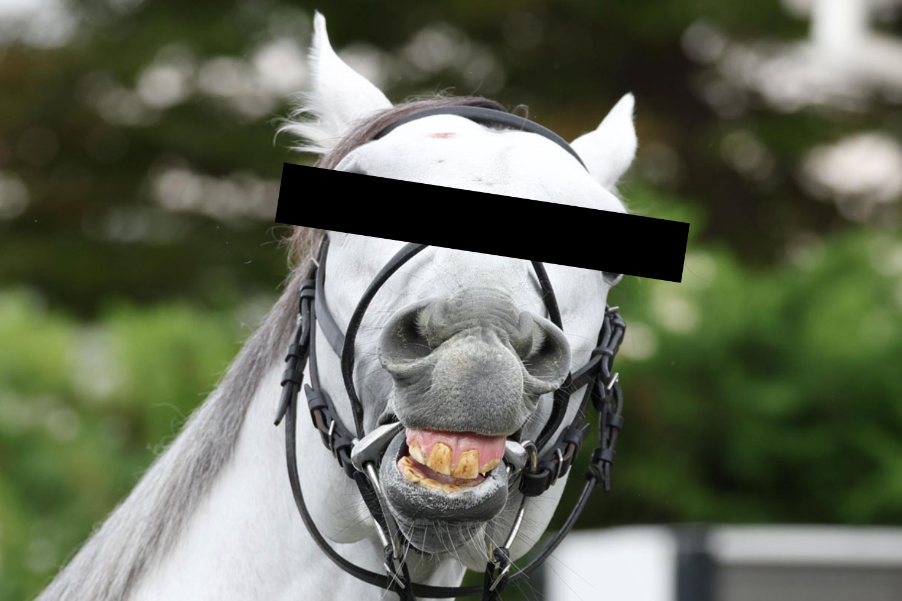
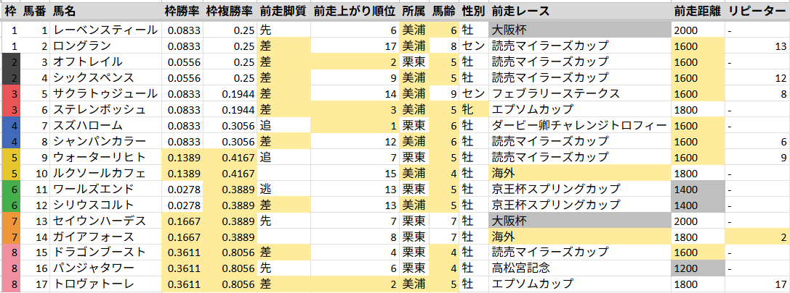
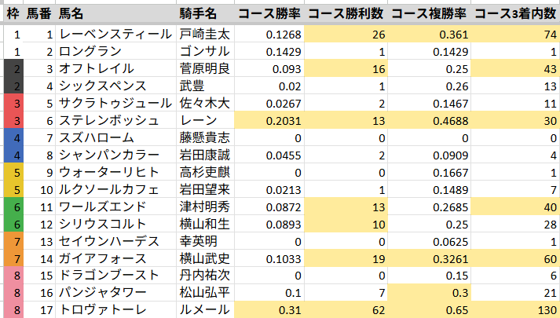
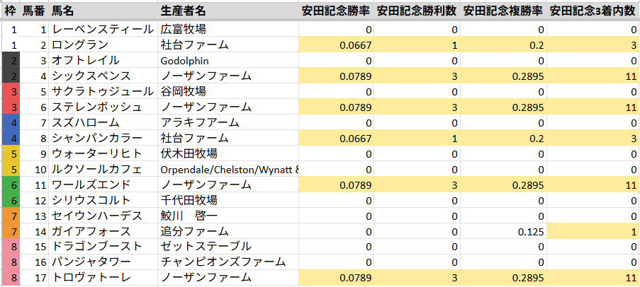
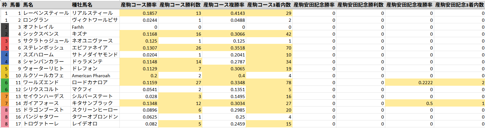

# 安田記念2026予想

？？？「シェ～ケシェケシェケシェケ。ジャンタルもソウルも浪漫勇士もナミュールもソングラインもセリフォスもシュネルもいない安田記念なんて勝ったも同然ｼｪｹねえ～」

## ポイント

- Cコース2周目で外差し有利
- リピーターが多いレース

## 前日の傾向

> Cコース2周目なので差し有利傾向のはずだが、土曜は馬券内15頭のうち11頭が逃げ先行と前有利傾向。低級条件の上位人気決着が多いため、バイアスよりも能力の差が出たか。

### 出目

3着以内に入った頭数

**人気**

| 1人気 | 2人気 | 3人気 | 4-6人気 | 7-9人気 | 10人気以下 |
| --- | --- | --- | --- | --- | --- |
| 5頭 | 5頭 | 2頭 | 2頭 | 0頭 | 1頭 |

**枠番**

| 1枠 | 2枠 | 3枠 | 4枠 | 5枠 | 6枠 | 7枠 | 8枠 |
| --- | --- | --- | --- | --- | --- | --- | --- |
| 3頭 | 3頭 | 2頭 | 1頭 | 2頭 | 2頭 | 2頭 | 0頭 |

**脚質**

| 逃げ | 先行 | 差し | 追込 |
| --- | --- | --- | --- |
| 3頭 | 8頭 | 2頭 | 2頭 |

**上がり順位**

| 1位 | 2位 | 3位 | 4-6位 | 7-9位 | 10位以下 |
| --- | --- | --- | --- | --- | --- |
| 3頭 | 3頭 | 2頭 | 4頭 | 2頭 | 1頭 |

### 東京4R 新馬 1400m 7頭

| 着順 | 枠 | 馬番 | 人気 | 4角通過順位 | 後3ハロン | 後3ハロン順位 |
| --- | --- | --- | --- | --- | --- | --- |
| 1着 | 2枠 | 2番 | 2人気 | 6番手 | 34.1秒 | 1位 |
| 2着 | 4枠 | 4番 | 1人気 | 3番手 | 34.4秒 | 2位 |
| 3着 | 5枠 | 5番 | 2人気 | 1番手 | 34.8秒 | 3位 |

### 東京5R 新馬 1600m 9頭

| 着順 | 枠 | 馬番 | 人気 | 4角通過順位 | 後3ハロン | 後3ハロン順位 |
| --- | --- | --- | --- | --- | --- | --- |
| 1着 | 2枠 | 2番 | 1人気 | 3番手 | 33.3秒 | 1位 |
| 2着 | 1枠 | 1番 | 3人気 | 1番手 | 33.7秒 | 2位 |
| 3着 | 6枠 | 6番 | 2人気 | 2番手 | 34.2秒 | 5位 |

### 東京7R 未勝利 2000m 16頭

| 着順 | 枠 | 馬番 | 人気 | 4角通過順位 | 後3ハロン | 後3ハロン順位 |
| --- | --- | --- | --- | --- | --- | --- |
| 1着 | 5枠 | 9番 | 2人気 | 12番手 | 33.4秒 | 1位 |
| 2着 | 3枠 | 6番 | 1人気 | 3番手 | 34.2秒 | 6位 |
| 3着 | 1枠 | 2番 | 5人気 | 1番手 | 34.6秒 | 7位 |

### 東京9R 1勝クラス(特別) 2400m 12頭

| 着順 | 枠 | 馬番 | 人気 | 4角通過順位 | 後3ハロン | 後3ハロン順位 |
| --- | --- | --- | --- | --- | --- | --- |
| 1着 | 6枠 | 8番 | 2人気 | 2番手 | 33.5秒 | 2位 |
| 2着 | 7枠 | 10番 | 1人気 | 3番手 | 33.8秒 | 4位 |
| 3着 | 7枠 | 9番 | 6人気 | 4番手 | 33.8秒 | 4位 |

### 東京10R 2勝クラス(特別) 1400m 17頭

| 着順 | 枠 | 馬番 | 人気 | 4角通過順位 | 後3ハロン | 後3ハロン順位 |
| --- | --- | --- | --- | --- | --- | --- |
| 1着 | 3枠 | 6番 | 3人気 | 6番手 | 33.5秒 | 7位 |
| 2着 | 2枠 | 4番 | 1人気 | 8番手 | 33.3秒 | 3位 |
| 3着 | 1枠 | 2番 | 16人気 | 4番手 | 33.9秒 | 12位 |

## 出走馬傾向

過去10年出走馬傾向に関する傾向

### 枠順

> 4枠より外が馬券内30頭中23頭を占める

| 枠順 | 1着 | 2着 | 3着 | 着外 | 勝率 | 複率 | 単回 | 複回 |
| --- | --- | --- | --- | --- | --- | --- | --- | --- |
| 1枠 | 0頭 | 1頭 | 1頭 | 15頭 | 0% | 12% | 0% | 24% |
| 2枠 | 0頭 | 2頭 | 0頭 | 15頭 | 0% | 12% | 0% | 29% |
| 3枠 | 1頭 | 1頭 | 1頭 | 16頭 | 5% | 16% | 101% | 49% |
| 4枠 | 1頭 | 3頭 | 1頭 | 14頭 | 5% | 26% | 19% | 55% |
| 5枠 | 3頭 | 1頭 | 1頭 | 15頭 | 15% | 25% | 284% | 74% |
| 6枠 | 0頭 | 1頭 | 0頭 | 19頭 | 0% | 5% | 0% | 6% |
| 7枠 | 4頭 | 0頭 | 4頭 | 17頭 | 16% | 32% | 321% | 96% |
| 8枠 | 1頭 | 1頭 | 2頭 | 21頭 | 4% | 16% | 30% | 57% |

### 人気

> 荒れても1桁人気まで

| 人気 | 1着 | 2着 | 3着 | 着外 | 勝率 | 複率 | 単回 | 複回 |
| --- | --- | --- | --- | --- | --- | --- | --- | --- |
| 1人気 | 1頭 | 3頭 | 4頭 | 2頭 | 10% | 80% | 36% | 108% |
| 2人気 | 1頭 | 1頭 | 2頭 | 6頭 | 10% | 40% | 43% | 67% |
| 3人気 | 1頭 | 2頭 | 1頭 | 6頭 | 10% | 40% | 120% | 97% |
| 4-6人気 | 3頭 | 2頭 | 2頭 | 23頭 | 10% | 23% | 116% | 68% |
| 7-9人気 | 4頭 | 2頭 | 1頭 | 23頭 | 13% | 23% | 375% | 117% |
| 10人気以下 | 0頭 | 0頭 | 0頭 | 72頭 | 0% | 0% | 0% | 0% |

### 脚質

> 差し追い込みが馬券内30頭中24頭を占める

| 脚質 | 1着 | 2着 | 3着 | 着外 | 勝率 | 複率 | 単回 | 複回 |
| --- | --- | --- | --- | --- | --- | --- | --- | --- |
| 逃げ | 1頭 | 2頭 | 0頭 | 7頭 | 10% | 30% | 369% | 120% |
| 先行 | 1頭 | 2頭 | 0頭 | 33頭 | 3% | 8% | 12% | 17% |
| 差し | 6頭 | 3頭 | 7頭 | 51頭 | 9% | 24% | 146% | 63% |
| 追込 | 2頭 | 3頭 | 3頭 | 41頭 | 4% | 16% | 57% | 46% |

### 前走脚質

| 前走脚質 | 1着 | 2着 | 3着 | 着外 | 勝率 | 複率 | 単回 | 複回 |
| --- | --- | --- | --- | --- | --- | --- | --- | --- |
| 逃げ | 0頭 | 2頭 | 1頭 | 7頭 | 0% | 30% | 0% | 84% |
| 先行 | 2頭 | 2頭 | 1頭 | 33頭 | 5% | 13% | 148% | 35% |
| 差し | 5頭 | 1頭 | 3頭 | 41頭 | 10% | 18% | 182% | 56% |
| 追込 | 1頭 | 1頭 | 3頭 | 35頭 | 2% | 12% | 31% | 41% |

### 前走上がり3F順位

> 前走上がり3位以内が馬券内30頭中21頭を占める

| 前走上がり3F順位 | 1着 | 2着 | 3着 | 着外 | 勝率 | 複率 | 単回 | 複回 |
| --- | --- | --- | --- | --- | --- | --- | --- | --- |
| 1位 | 2頭 | 3頭 | 3頭 | 20頭 | 7% | 29% | 99% | 60% |
| 2位 | 4頭 | 3頭 | 3頭 | 22頭 | 12% | 31% | 135% | 68% |
| 3位 | 0頭 | 0頭 | 2頭 | 7頭 | 0% | 22% | 0% | 66% |
| 4位以下 | 3頭 | 4頭 | 2頭 | 79頭 | 3% | 10% | 105% | 42% |

### 所属

> 美浦が優勢

| 所属 | 1着 | 2着 | 3着 | 着外 | 勝率 | 複率 | 単回 | 複回 |
| --- | --- | --- | --- | --- | --- | --- | --- | --- |
| 美浦 | 5頭 | 7頭 | 5頭 | 46頭 | 8% | 27% | 178% | 76% |
| 栗東 | 4頭 | 3頭 | 5頭 | 81頭 | 4% | 13% | 56% | 36% |
| 地方 | 0頭 | 0頭 | 0頭 | 0頭 | - | - | - | - |
| 海外 | 1頭 | 0頭 | 0頭 | 5頭 | 17% | 17% | 60% | 27% |

### 馬齢

> 4,5,6歳が中心

| 馬齢 | 1着 | 2着 | 3着 | 着外 | 勝率 | 複率 | 単回 | 複回 |
| --- | --- | --- | --- | --- | --- | --- | --- | --- |
| 3歳 | 0頭 | 0頭 | 1頭 | 3頭 | 0% | 25% | 0% | 60% |
| 4歳 | 5頭 | 3頭 | 2頭 | 33頭 | 12% | 23% | 138% | 54% |
| 5歳 | 2頭 | 5頭 | 3頭 | 39頭 | 4% | 20% | 112% | 54% |
| 6歳 | 3頭 | 1頭 | 2頭 | 31頭 | 8% | 16% | 143% | 56% |
| 7歳以上 | 0頭 | 1頭 | 2頭 | 26頭 | 0% | 10% | 0% | 36% |

### 性別

> 勝率複勝率では牝馬が優勢

| 性別 | 1着 | 2着 | 3着 | 着外 | 勝率 | 複率 | 単回 | 複回 |
| --- | --- | --- | --- | --- | --- | --- | --- | --- |
| 牡 | 6頭 | 5頭 | 9頭 | 112頭 | 5% | 15% | 103% | 48% |
| 牝 | 3頭 | 5頭 | 1頭 | 11頭 | 15% | 45% | 138% | 91% |
| セン | 1頭 | 0頭 | 0頭 | 9頭 | 10% | 10% | 36% | 16% |

### 前走レース

> 前走海外、ヴィクトリアマイルが優勢。G1だが大阪杯から直行は不振。（当日5番人気以内でも0-0-1-8）

| 前走レース | 1着 | 2着 | 3着 | 着外 | 勝率 | 複率 | 単回 | 複回 |
| --- | --- | --- | --- | --- | --- | --- | --- | --- |
| 海外 | 2頭 | 4頭 | 2頭 | 16頭 | 8% | 33% | 33% | 70% |
| ヴィクトリアマイル | 2頭 | 5頭 | 0頭 | 8頭 | 13% | 47% | 104% | 102% |
| 読売マイラーズカップ | 1頭 | 0頭 | 4頭 | 33頭 | 3% | 13% | 50% | 31% |
| 京王杯スプリングカップ | 1頭 | 0頭 | 1頭 | 20頭 | 5% | 9% | 56% | 33% |
| 高松宮記念 | 1頭 | 0頭 | 1頭 | 9頭 | 9% | 18% | 109% | 64% |
| 天皇賞（秋） | 1頭 | 0頭 | 0頭 | 0頭 | 100% | 100% | 4760% | 710% |
| ＮＨＫマイルカップ | 0頭 | 0頭 | 1頭 | 3頭 | 0% | 25% | 0% | 60% |
| ダービー卿チャレンジトロフィー | 1頭 | 0頭 | 0頭 | 10頭 | 9% | 9% | 336% | 47% |
| 中山記念 | 0頭 | 1頭 | 0頭 | 4頭 | 0% | 20% | 0% | 88% |
| 大阪杯 | 0頭 | 0頭 | 1頭 | 16頭 | 0% | 6% | 0% | 9% |
| フェブラリーステークス | 0頭 | 0頭 | 0頭 | 2頭 | 0% | 0% | 0% | 0% |
| 日経賞 | 0頭 | 0頭 | 0頭 | 2頭 | 0% | 0% | 0% | 0% |
| 産経大阪杯 | 0頭 | 0頭 | 0頭 | 1頭 | 0% | 0% | 0% | 0% |
| ＪＢＣスプリント（中央交流）　Ｊｐｎ１ | 0頭 | 0頭 | 0頭 | 1頭 | 0% | 0% | 0% | 0% |
| 東京新聞杯 | 0頭 | 0頭 | 0頭 | 4頭 | 0% | 0% | 0% | 0% |
| その他 | 1頭 | 0頭 | 0頭 | 3頭 | 25% | 25% | 392% | 102% |

### 前走距離

> 距離延長は若干マイナス

| 前走距離 | 1着 | 2着 | 3着 | 着外 | 勝率 | 複率 | 単回 | 複回 |
| --- | --- | --- | --- | --- | --- | --- | --- | --- |
| 距離延長 | 3頭 | 0頭 | 2頭 | 31頭 | 8% | 14% | 111% | 51% |
| 同距離 | 5頭 | 7頭 | 5頭 | 70頭 | 6% | 20% | 87% | 50% |
| 距離短縮 | 2頭 | 3頭 | 3頭 | 31頭 | 5% | 21% | 131% | 55% |

### リピーター

> 前年安田記念5着以内だった馬が馬券内30頭中14頭を占める。

| リピーター | 1着 | 2着 | 3着 | 着外 | 勝率 | 複率 | 単回 | 複回 |
| --- | --- | --- | --- | --- | --- | --- | --- | --- |
| 前年3着以内 | 1頭 | 6頭 | 3頭 | 5頭 | 7% | 67% | 49% | 126% |
| 前年4着以内 | 2頭 | 8頭 | 4頭 | 6頭 | 10% | 70% | 99% | 174% |
| 前年5着以内 | 2頭 | 8頭 | 4頭 | 8頭 | 9% | 64% | 90% | 158% |
| 前年6着以下 | 1頭 | 1頭 | 2頭 | 20頭 | 4% | 17% | 198% | 70% |
| 前年出走無し | 7頭 | 1頭 | 4頭 | 104頭 | 6% | 10% | 86% | 27% |

### 比較表

> 圧倒的リピーターレース

- ガイアフォース（前年2着、一昨年4着、3年前4着）
- シャンパンカラー（前年6着）

※ 枠勝率は過去5年東京芝1600mCコース2週目の集計

## 騎手傾向

過去10年騎手傾向に関する傾向

### 騎手

| 騎手 | 1着 | 2着 | 3着 | 着外 | 勝率 | 複率 | 単回 | 複回 |
| --- | --- | --- | --- | --- | --- | --- | --- | --- |
| ルメール | 1頭 | 3頭 | 2頭 | 3頭 | 11% | 67% | 174% | 123% |
| 戸崎圭太 | 1頭 | 2頭 | 0頭 | 6頭 | 11% | 33% | 82% | 83% |
| レーン　 | 0頭 | 1頭 | 1頭 | 3頭 | 0% | 40% | 0% | 146% |
| 武豊　　 | 0頭 | 1頭 | 0頭 | 8頭 | 0% | 11% | 0% | 33% |
| 横山武史 | 0頭 | 0頭 | 1頭 | 3頭 | 0% | 25% | 0% | 60% |
| ゴンサル | 0頭 | 0頭 | 0頭 | 0頭 | - | - | - | - |
| 菅原明良 | 0頭 | 0頭 | 0頭 | 3頭 | 0% | 0% | 0% | 0% |
| 佐々木大 | 0頭 | 0頭 | 0頭 | 0頭 | - | - | - | - |
| 藤懸貴志 | 0頭 | 0頭 | 0頭 | 0頭 | - | - | - | - |
| 岩田康誠 | 0頭 | 0頭 | 0頭 | 8頭 | 0% | 0% | 0% | 0% |
| 高杉吏麒 | 0頭 | 0頭 | 0頭 | 0頭 | - | - | - | - |
| 岩田望来 | 0頭 | 0頭 | 0頭 | 3頭 | 0% | 0% | 0% | 0% |
| 津村明秀 | 0頭 | 0頭 | 0頭 | 2頭 | 0% | 0% | 0% | 0% |
| 横山和生 | 0頭 | 0頭 | 0頭 | 4頭 | 0% | 0% | 0% | 0% |
| 幸英明　 | 0頭 | 0頭 | 0頭 | 3頭 | 0% | 0% | 0% | 0% |
| 丹内祐次 | 0頭 | 0頭 | 0頭 | 1頭 | 0% | 0% | 0% | 0% |
| 松山弘平 | 0頭 | 0頭 | 0頭 | 4頭 | 0% | 0% | 0% | 0% |

### 比較表

> 結局外人じゃ。武史と戸崎も優秀

- トロヴァトーレ（ルメール）
- ステレンボッシュ（レーン）
- ガイアフォース（横山武史）
- レーベンスティール（戸崎）

※ 過去5年東京芝1600m

## 生産者傾向

過去10年生産者傾向に関する傾向

### 生産者

| 生産者 | 1着 | 2着 | 3着 | 着外 | 勝率 | 複率 | 単回 | 複回 |
| --- | --- | --- | --- | --- | --- | --- | --- | --- |
| ノーザンファーム | 5頭 | 5頭 | 4頭 | 38頭 | 10% | 27% | 114% | 64% |
| 社台ファーム | 2頭 | 1頭 | 2頭 | 16頭 | 10% | 24% | 196% | 92% |
| Northern Farm | 0頭 | 1頭 | 2頭 | 0頭 | 0% | 100% | 0% | 203% |
| 下河辺牧場 | 0頭 | 0頭 | 2頭 | 8頭 | 0% | 20% | 0% | 29% |
| 追分ファーム | 0頭 | 2頭 | 0頭 | 11頭 | 0% | 15% | 0% | 58% |
| その他 | 3頭 | 1頭 | 0頭 | 59頭 | 5% | 6% | 106% | 22% |

### 比較表

> ノーザン、社台が優勢

- ロングラン（社台）
- シックスペンス（ノーザン）
- ステレンボッシュ（ノーザン）
- シャンパンカラー（社台）
- ワールズエンド（ノーザン）
- トロヴァトーレ（ノーザン）

## 血統傾向

過去10年血統傾向に関する傾向

### 種牡馬

| 種牡馬 | 1着 | 2着 | 3着 | 着外 | 勝率 | 複率 | 単回 | 複回 |
| --- | --- | --- | --- | --- | --- | --- | --- | --- |
| ディープインパクト | 3頭 | 1頭 | 1頭 | 25頭 | 10% | 17% | 240% | 61% |
| Kingman | 0頭 | 1頭 | 2頭 | 0頭 | 0% | 100% | 0% | 203% |
| キズナ | 2頭 | 0頭 | 0頭 | 4頭 | 33% | 33% | 260% | 80% |
| クロフネ | 0頭 | 2頭 | 0頭 | 1頭 | 0% | 67% | 0% | 177% |
| ステイゴールド | 1頭 | 0頭 | 1頭 | 2頭 | 25% | 50% | 480% | 105% |
| ハーツクライ | 0頭 | 0頭 | 2頭 | 9頭 | 0% | 18% | 0% | 62% |
| ルーラーシップ | 0頭 | 0頭 | 2頭 | 3頭 | 0% | 40% | 0% | 58% |
| ローエングリン | 1頭 | 1頭 | 0頭 | 0頭 | 50% | 100% | 1845% | 480% |
| ロードカナロア | 0頭 | 1頭 | 1頭 | 10頭 | 0% | 17% | 0% | 18% |
| その他 | 3頭 | 4頭 | 1頭 | 78頭 | 3% | 9% | 27% | 26% |

### 比較表

> コース好走率はリアルスティール、エピファネイア、ロードカナロア、キズナ、ドレフォン、キタサンブラック

- レーベンスティール（リアルスティール）
- シックスペンス（キズナ）
- ステレンボッシュ（エピファネイア）
- ウォーターリヒト（ドレフォン）
- ワールズエンド（ロードカナロア）
- ガイアフォース（キタサンブラック）

※ 過去5年東京芝1600m

## 印

◎14ガイアフォース  
○8シャンパンカラー  
▲9ウォーターリヒト  
△13セイウンハーデス  
△6ステレンボッシュ  
◆15ドラゴンブースト  
◆1レーベンスティール  
◆16パンジャタワー  
◆3オフトレイル  
◆4シックスペンス  
注17トロヴァトーレ  

## 見解

### ◎14ガイアフォース

ついにこの時がやってきたｼｪｹ。  

前走海外G1ドバイターフは6着に負けたけど海外はノーカンでいいｼｪｹ。前日にめちゃくちゃ強い雨が降ってぐちゃぐちゃになったのがしんどかったｼｪｹねえ。  
前々走G1マイルCSは0.3秒差2着だったｼｪｹ。内枠から馬群に包まれて終始折り合いを欠いていたｼｪｹ。展開はやや前有利が向いたｼｪｹが、直線も荒れた内を通って馬群を割る競馬ができたｼｪｹ。ジャンタルマンタルにはまた負けたｼｪｹが、スムーズでない中でこのメンバーで2着は評価して欲しいｼｪｹ。  
3走前G2富士Sは0.1秒差でジャンタルに勝ったｼｪｹ！Sペースの前有利を2番手先行したので展開向いたｼｪｹが、同様に3番手先行した王者ジャンタルマンタルを凌ぎ切ったので褒めて欲しいｼｪｹ。外枠なら折り合いを欠かないことがわかったｼｪｹ。  
4走前去年のG1安田記念は0.2秒差2着だったｼｪｹ。8番手から上がり2位33.9で追い込んだｼｪｹ。やや差し有利展開向いたｼｪｹが直線では外に進路を探す不利があったｼｪｹ。筆者はこのとき9人気のオレを対抗評価して脳汁出まくったらしいｼｪｹねえ。  
そして何より23年の天皇賞秋が強かったｼｪｹ。5着だったｼｪｹが、超差し有利展開を2番手先行して残したｼｪｹ。イクイノックスとかいうバケモンが3番手から勝ち切ったせいで目立ってないｼｪｹが、同じように先行して5着に残したのは評価して欲しいｼｪｹ。

オレが国内の芝1600mで負けた相手は7頭しかいないｼｪｹ。どいつもこいつもバケモンだったｼｪｹ。

- シュネルマイスター（G1馬）
- ソングライン（G1 3勝）
- セリフォス（G1馬）
- ロマンチックウォリアー（G1 14勝）
- ナミュール（G1馬）
- ソウルラッシュ（G1 2勝）
- ジャンタルマンタル（G1 4勝）

ちなみに牡馬が出走可能な芝マイルG1完全制覇したバケモンのジャンタルマンタルに国内の芝マイルで先着したことあるのはオレしかいないｼｪｹ。  
今年の安田記念はメンバーがしょぼすぎるｼｪｹ。みんなロックンロールが足りてないｼｪｹ。武史も会見で言ってたｼｪｹ。  
外差し有利の安田記念で7枠14番を取れたのもデカいｼｪｹ。 
武史に久しぶりのG1勝利をもたらすのはこのオレしかいないｼｪｹねえ～！

### ○8シャンパンカラー

前走G2マイラーズCは0.4秒差9着。まずまずのスタート。内前展開は若干向いてないが2着ドラゴンブーストの1つ外にいたので着差を考えるともう少しやれて欲しかった。外を伸び伸びと走ったほうがよさそう。  
2走前G2中山記念は0.7秒差10着。まずまずのスタート。内前有利で1コーナーでは9番手で5頭分外を回し4角は大外ぶん回し。度外視でいい。  
3走前G3東京新聞杯は0.1秒差4着。出遅れ。1000m58.2秒のハイペースで差し有利展開向いたものの、さすがに14番手からでは届かなかった。ただし斤量59kgを背負いながら走破タイムと上がりはキャリア最速。どこかで馬券になるかもしれないと思わせた。  
4走前G1マイルCSは1.3秒差14着。出遅れ。しかし二の足は悪くなく中団8番手。差し馬なのに上がりがほとんど使えず、物足りない内容。内枠は良くないか。  
5走前G2富士Sは0.8秒差8着。上がり3位33.1秒も13番手からでは届かず。Sペースの前有利が向かなかった。  
6走前G1安田記念は0.5秒差6着。大出遅れ。やや差し有利展開向いたが、17番手から上がり2位に0.3秒差付ける最速33.6秒で6着まで追い込んでおり強かった。  

リピーターレースの安田記念において、前年1,3,4,5着馬不在の6着馬は魅力。  
去年は大出遅れだったが、近2走はまずまずのスタート。今回出遅れず去年と同じパフォーマンスができればアタマまで期待できる。
13戦連続馬券外で（いつも通り）かなり人気がないが、ここは狙い目。

### ▲9ウォーターリヒト

前走G2マイラーズCは0.5秒差13着。Cコース初週の内前有利展開で4角14番手からでは届かない。度外視でいい。  
2走前G3東京新聞杯は0.1秒差3着。1000m58.2秒のハイペースで差し有利展開向いた。ただし直線で大きく接触する不利がありスムーズなら勝っていた。  
3走前G1マイルCSは0.3秒差3着。やや前有利を8番手から上がり3位33.0。展開はやや向いてないが、外目スムーズだった分ガイアフォースの方が強かったか。  
4走前G2富士は0.8秒差9着。上がり2位33.0秒も13番手からでは届かず。Sペースの前有利が向かなかったので度外視でいい。  
6走前G1安田記念は0.6秒差9着。やや差し有利展開向いたが、上がり2位33.9秒でも15番手からでは厳しかった。  

東京芝1600mは3-0-1-3と好相性。  
10月~3月が4-2-5-3に対して4月~9月が0-0-0-5と夏が苦手な傾向があるが、今日の東京は21℃と6月にしてはちょっと寒いので問題ないということに差せていただく。  
外枠の差し馬でオッズがかなりついている点も考慮して単穴評価。

### △13セイウンハーデス

前走G1大阪杯は0.4秒差5着健闘。控えて成果を出せたのは収穫。外から交わされるとやる気をなくす馬で外枠の方がよさそう。  
2走前G2中山記念はハイペース逃げ。1コーナーを出るあたりまでは落ち着いていたが、その後はエキサイトしてペースを落とせず、600m通過後は11.5-11.4-11.5と中盤で息を入れられなかった。  

天皇賞秋7着、大阪杯5着など、超ハイレベルG1でそこそこやれており、このメンバーであれば実力上位。  
外枠は良いが、前走大阪杯組がかなり不振なのと、先行してしまうと今日は厳しそうなので連下評価まで。

### △6ステレンボッシュ

前走G3エプソムCはハナ差2着。4角7番手から上がり3位33.1でわずかに差される。Aコース最終週で大外決着したNHKマイルCの前日で、大外枠から道中も外を走れており圧倒的外差し有利馬場が向いた。  
2走前G3中山牝馬Sは0.6秒差7着。4角1-5番手の5頭が6着まで埋める前有利展開を13番手からでは厳しかった。  

長らく不調だったが前走で復活気配。牝馬は一度調子を崩すとなかなか立て直せないので心配ではあるが、この世代の牝馬好きなので頑張って欲しい。  
美浦所属牝馬の5歳で鞍上も生産者も血統も好走傾向。もっと外が良かったが、差し展開も向きそう。

### △3オフトレイル

前走G2マイラーズCは0.2秒差5着。やや出遅れ。Cコース初週の内前有利を内枠から最内で立ち回れたのは良かったが、4角10番手から上がり2位で0.2秒差は強かった。同様に展開向かなかった2着ドラゴンブーストとの差は位置取りだけ。  
3走前G1マイルCSは0.4秒差4着。やや外前有利の展開を内の13番手で展開向かなかった。それでも上がり最速32.6で3着とクビ差まで追い込んでおり強かった。  

内枠なので評価を下げたがマイルCSではガイアフォースと0.1秒差に走っており、舐められすぎな印象。

### ◆1レーベンスティール

前走G1大阪杯は0.5秒差6着。道中はクロワデュノールの後ろ。勝ち馬の後ろは良い位置に見えるが、勝ち馬がバケモンでありこの馬にハイペースの阪神2000で外々を回って突き抜けるほどの力はなかった。直線クロワデュノールのフラつきの影響を受けていないわけではないが、そもそも脚色が良くなかった。パドックでもかなりうるさかったように、テンション面の調整も難しい馬。GIとなるとかなり色々揃う必要がある。2200mもオールカマーを勝っているとはいえ、今は1800がベスト。  
2走前G2中山記念は0.3秒差1着。内前3頭決着のレースで内3番手の絶好位。展開向いたが1800mでは格が違った。  
3走前G1マイルCSは1.1秒差12着。展開やや向かないも、オフトレイルより前にいたので物足りない。やはり関西遠征は合わないか。

東京・中山7-2-0-2と地元でイキるタイプ。  
G2を4勝するG2番長でG1ではいつも物足りない。  
今回はG1にしてはかなりメンバーが手薄なので狙い目も、やはり非根幹距離の方が得意なのと、今日の馬場で最内枠はマイナス。

### ◆15ドラゴンブースト

前走G2マイラーズC0.1秒差2着。Cコース初週の内前有利を道中は中団最内で進める。直線も内を通り馬群を割る競馬。4角8番手上がり3位なので馬券内の中では一番強かった。  
出走していれば上位人気確実のアドマイヤズームに0.1秒差まで迫っているのにこの人気は舐められすぎに思える。  

### ◆16パンジャタワー

前走G1高松宮記念は3着とアタマ差4着。序盤に接触不利。最内で経済コースを回れたのはよかったが直線で前にいたピューロマジックとインビンシブルパパをかわす必要があり忙しかった。最内はやはり仇となった。サウジから帰国10日で仕上げており態勢も万全ではなかったか。  
実力上位も、ベストは1400mでマイルは長い印象。

### ◆4シックスペンス

前走G2マイラーズCは0.4秒差7着。Cコース初週の内前有利を大外枠から中団外目を追走しやや展開向かなかった。  
2走前G1フェブラリーSは差し有利展開を逃げて9着。度外視でいい。芝の方がいいのでは。  
5走前G1安田記念は0.7秒差12着。やや外差し有利展開を最内枠から4番手先行したので展開向かなかった。  

今回初ブリンカーなので要注意も、内枠の先行脚質は今日は厳しそう。

### 注17トロヴァトーレ

前走G3エプソムCはハナ差1着。4角9番手から上がり2位33.0で差し切り。Aコース最終週で大外決着したNHKマイルCの前日で圧倒的外差し有利馬場が向いた。  
2走前G3東京新聞杯はクビ差1着。1000m58.2秒のハイペースで差し有利展開向いた。  
3走前G3京都金杯は0.2秒差4着。トップハンデ58.5kg背負い前残り展開で4角15番手から上がり最速4着で負けて強し。  
6走前G1安田記念は1.4秒差17着。ガイアフォースの前、ほぼ同じ位置にいたことを考えると負けすぎか。直線で内を選択したのは良くなかったように見える。  

重賞2連勝で神がお乗りになる馬なので人気しているが、前走も前々走も展開向いて僅差勝ちなので明らかに過剰人気。  
今週はお休みしていただきます。

？？？「こいつ去年の安田記念17着ｼｪｹ。オレと1.2秒差あるｼｪｹ。雑魚ｼｪｹ。」

## 買い目

妙味微妙と思いつつ、単勝が本線。  
馬連はおまけ程度に。

単勝◎  
馬連◎-○▲