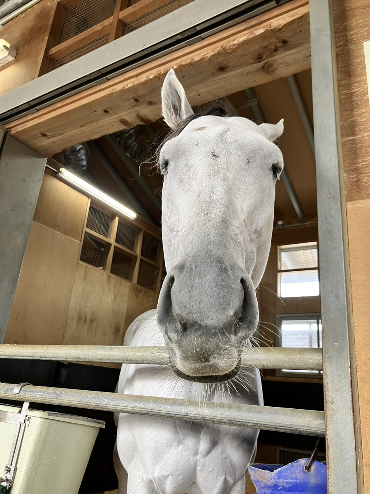
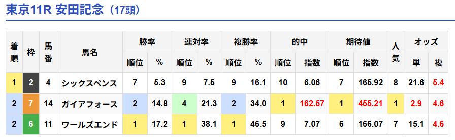

# 安田記念2026回顧

？？？「また2着ｼｪｹ…なんで前有利展開になるｼｪｹ…」

## 結果

1着 ◆4シックスペンス  
2着 ◎14ガイアフォース  
2着 11ワールズエンド  

## 総評

差し展開予想だったのになぜか前残り展開に。  
競馬なんもわからん。  
それでも2着に持ってくるシェケはさすが。

自作AIはワールズエンド推してた。  
なんで安田記念で逃げ馬本命にできるのか教えてくれ。

## 回顧

### 1着 ◆4シックスペンス

クビ差1着。  
折り合いつく。  
Sペースの前有利を2番手先行して展開向いた。  
1年以上勝ち星から遠ざかっていたが、初ブリンカーと異例の前日調教が効いたか。  
前年安田記念2桁着順からの優勝は史上初。  
武豊は自身最低人気G1勝利と最年長G1勝利記録を更新。  

### 2着 ◎14ガイアフォース

クビ差同着2着。  
外枠からスムーズに中団外目を確保し絶好位に見えたが、実際はSペースの前有利で1,2着は4角1,2番手。  
上がり最速33.0秒も8番手からでは届かず負けて強しのレースになってしまった。  
G1未勝利馬のG1 2着4回は史上最多タイ。  

### 2着 11ワールズエンド

クビ差同着2着。  
Sペースの前有利を逃げて展開向いた。  

### 4着 △13セイウンハーデス

クビ差4着。  
4角1,2番手が1,2着になるSペースの前有利を3番手先行して展開向いた。  
前展開でこのメンバーならもう少しやれて欲しかった。  

### 5着 ◆16パンジャタワー

0.1秒差5着。  
4角1,2,3番手が1,2,4着になるSペースの前有利を6番手先行したのでやや展開向いた。  
　上がりは5位で悪くはないが、やはりマイルは少し長いか。  

### 6着 ◆3オフトレイル

0.2秒差6着。  
4角1,2,3番手が1,2,4着になるSペースの前有利を4角7番手でやや展開向いたが、荒れた内を走らされたのは厳しかった。  
やはり坂のない京都の方が合うか。  

### 7着 ◆1レーベンスティール

0.5秒差7着。  
4角1,2,3番手が1,2,4着になるSペースの前有利を4角4番手先行したので展開向いた。  
着差と能力を考えると物足りない内容。  
このメンバーで展開向いて7着だとG1ではやはり厳しいか。  

### 8着 ◆15ドラゴンブースト

0.6秒差8着。  
4角1,2,3番手が1,2,4着になるSペースの前有利を4角9番手で展開向かなかったにも関わらず人気以上に走っており、よくやったように思う。  
今後のG1も差し有利なら馬券内もありえる。  

### 9着 注17トロヴァトーレ

0.7秒差9着。  
4角1,2,3番手が1,2,4着になるSペースの前有利を14番手からでは上がり2位33.1秒でも届かない。  
スタート後はわざと下げているように見えるので、ルメールも差し決着予想だったのかもしれない。  
直線で外を回しすぎたロスも響いた。  

### 10着 △6ステレンボッシュ

0.8秒差10着。  
4角1,2,3番手が1,2,4着になるSペースの前有利を4角7番手ではガイアフォースレベルの上がりが使えないと届かない。  

### 11着 10ルクソールカフェ

0.8秒差11着。  
4角1,2,3番手が1,2,4着になるSペースの前有利を14番手からでは上がり3位33.2秒でも届かない。  
ダート馬の芝初出走にしてはやれていた印象。  

### 12着 ○8シャンパンカラー

1.0秒差12着。  
スタート出る。  
4角1,2,3番手が1,2,4着になるSペースの前有利を4角12番手で展開向かなかった。  
道中も直線も荒れた内を通らされたのも向かなかった。  

### 13着 ▲9ウォーターリヒト

1.0秒差13着。  
4角1,2,3番手が1,2,4着になるSペースの前有利を17番手からでは上がり2位33.1秒でも届かない。  
いつも差し競馬で展開待ちになってしまうのは難点。  

### 14着 12シリウスコルト

1.1秒差14着。  
4角1,2,3番手が1,2,4着になるSペースの前有利を4角12番手で展開向かなかった。  
直線で外を回しすぎたロスも響いた。  

### 15着 5サクラトゥジュール

1.2秒差15着。  
4角1,2,3番手が1,2,4着になるSペースの前有利を4角9番手からでは厳しかった。  

### 16着 2ロングラン

1.3秒差16着。  
4角1,2,3番手が1,2,4着になるSペースの前有利を4角4番手からこの着差なので能力が足りなかった。  

### 17着 7スズハローム

1.8秒差17着。  
4角1,2,3番手が1,2,4着になるSペースの前有利を14番手からでは届かないが、上がりも使えていないのでここでは能力が足りなかった。  

