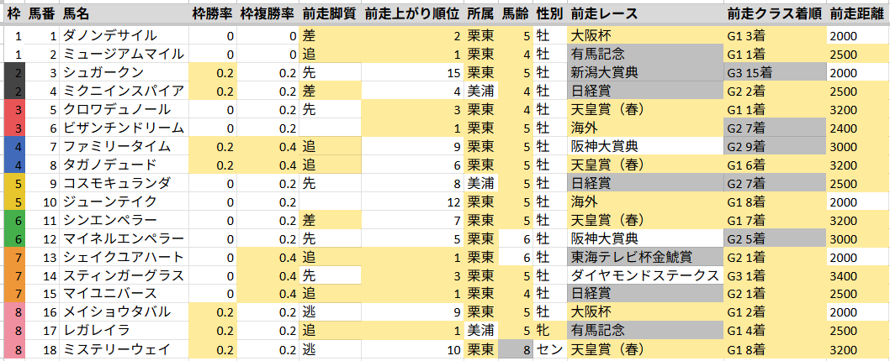
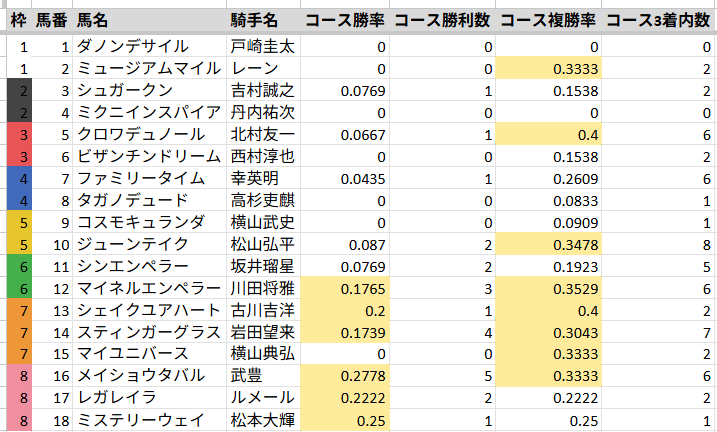
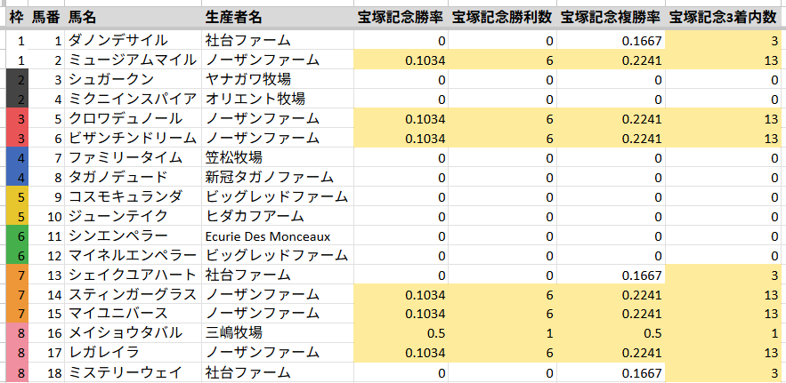
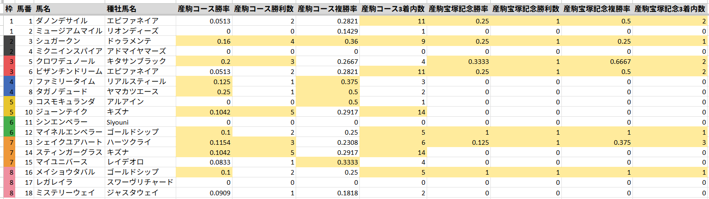

# 宝塚記念2026傾向分析

## 出走馬傾向

過去10年出走馬傾向に関する傾向

### 枠順

| 枠順 | 着度数 | 勝率 | 複率 | 単回 | 複回 |
| --- | --- | --- | --- | --- | --- |
| 1枠 | 0-1-0-1 | 0% | 50% | 0% | 175% |
| 2枠 | 0-0-1-2 | 0% | 33% | 0% | 47% |
| 3枠 | 1-0-0-2 | 33% | 33% | 140% | 60% |
| 4枠 | 0-0-1-3 | 0% | 25% | 0% | 60% |
| 5枠 | 1-1-0-2 | 25% | 50% | 45% | 90% |
| 6枠 | 0-0-0-4 | 0% | 0% | 0% | 0% |
| 7枠 | 0-0-0-5 | 0% | 0% | 0% | 0% |
| 8枠 | 0-0-0-5 | 0% | 0% | 0% | 0% |

※過去10年阪神4日目良馬場のみ

### 人気

| 人気 | 着度数 | 勝率 | 複率 | 単回 | 複回 |
| --- | --- | --- | --- | --- | --- |
| 1人気 | 2-3-0-4 | 22% | 56% | 34% | 70% |
| 2人気 | 2-0-3-4 | 22% | 56% | 92% | 91% |
| 3人気 | 2-0-0-7 | 22% | 22% | 160% | 73% |
| 4-6人気 | 0-3-3-21 | 0% | 22% | 0% | 79% |
| 7-9人気 | 3-1-0-23 | 11% | 15% | 184% | 54% |
| 10人気以下 | 0-2-3-52 | 0% | 9% | 0% | 67% |

※過去10年阪神のみ

### 脚質

| 脚質 | 着度数 | 勝率 | 複率 | 単回 | 複回 |
| --- | --- | --- | --- | --- | --- |
| 逃げ | 0-1-0-1 | 0% | 50% | 0% | 175% |
| 先行 | 2-0-1-6 | 22% | 33% | 67% | 48% |
| 差し | 0-1-1-7 | 0% | 22% | 0% | 54% |
| 追込 | 0-0-0-10 | 0% | 0% | 0% | 0% |

※過去10年阪神4日目良馬場のみ

### 前走脚質

| 前走脚質 | 着度数 | 勝率 | 複率 | 単回 | 複回 |
| --- | --- | --- | --- | --- | --- |
| 逃げ | 1-1-1-0 | 33% | 100% | 140% | 223% |
| 先行 | 0-0-0-11 | 0% | 0% | 0% | 0% |
| 差し | 0-1-1-7 | 0% | 22% | 0% | 54% |
| 追込 | 0-0-0-3 | 0% | 0% | 0% | 0% |

※過去10年阪神4日目良馬場のみ

### 上がり3F順位

| 上がり3F順位 | 着度数 | 勝率 | 複率 | 単回 | 複回 |
| --- | --- | --- | --- | --- | --- |
| 1位 | 1-1-0-0 | 50% | 100% | 90% | 180% |
| 2位 | 0-0-1-2 | 0% | 33% | 0% | 80% |
| 3位 | 1-0-0-0 | 100% | 100% | 420% | 180% |
| 4位以下 | 0-1-1-22 | 0% | 8% | 0% | 20% |

※過去10年阪神4日目良馬場のみ

### 前走上がり3F順位

| 前走上がり3F順位 | 着度数 | 勝率 | 複率 | 単回 | 複回 |
| --- | --- | --- | --- | --- | --- |
| 1位 | 1-0-1-3 | 20% | 40% | 84% | 64% |
| 2位 | 1-1-0-0 | 50% | 100% | 90% | 230% |
| 3位 | 0-0-0-3 | 0% | 0% | 0% | 0% |
| 4位以下 | 0-1-1-18 | 0% | 10% | 0% | 24% |

※過去10年阪神4日目良馬場のみ

### 所属

| 所属 | 着度数 | 勝率 | 複率 | 単回 | 複回 |
| --- | --- | --- | --- | --- | --- |
| 美浦 | 4-4-0-25 | 12% | 24% | 120% | 78% |
| 栗東 | 5-4-9-86 | 5% | 17% | 34% | 61% |
| 地方 | 0-0-0-0 | - | - | - | - |
| 海外 | 0-1-0-0 | 0% | 100% | 0% | 550% |

※過去10年阪神のみ

### 馬齢

| 馬齢 | 着度数 | 勝率 | 複率 | 単回 | 複回 |
| --- | --- | --- | --- | --- | --- |
| 3歳 | 0-0-0-1 | 0% | 0% | 0% | 0% |
| 4歳 | 4-1-4-27 | 11% | 25% | 58% | 75% |
| 5歳 | 5-4-4-36 | 10% | 27% | 111% | 91% |
| 6歳 | 0-3-1-24 | 0% | 14% | 0% | 65% |
| 7歳以上 | 0-1-0-23 | 0% | 4% | 0% | 23% |

※過去10年阪神のみ

### 性別

| 性別 | 着度数 | 勝率 | 複率 | 単回 | 複回 |
| --- | --- | --- | --- | --- | --- |
| 牡 | 5-7-6-92 | 5% | 16% | 36% | 61% |
| 牝 | 4-1-3-12 | 20% | 40% | 182% | 110% |
| セン | 0-1-0-7 | 0% | 12% | 0% | 69% |

※過去10年阪神のみ

### 前走レース

| 前走レース | 着度数 | 勝率 | 複率 | 単回 | 複回 |
| --- | --- | --- | --- | --- | --- |
| 天皇賞（春） | 2-2-4-29 | 5% | 22% | 47% | 101% |
| 海外 | 4-2-1-19 | 15% | 27% | 76% | 65% |
| 大阪杯 | 2-3-1-20 | 8% | 23% | 50% | 52% |
| ヴィクトリアマイル | 0-0-2-0 | 0% | 100% | 0% | 345% |
| 目黒記念 | 1-0-1-10 | 8% | 17% | 209% | 95% |
| ローレル競馬場賞中山牝馬ステークス | 0-1-0-0 | 0% | 100% | 0% | 560% |
| 鳴尾記念 | 0-1-0-13 | 0% | 7% | 0% | 25% |
| 安田記念 | 0-0-0-2 | 0% | 0% | 0% | 0% |
| エプソムカップ | 0-0-0-3 | 0% | 0% | 0% | 0% |
| 有馬記念 | 0-0-0-1 | 0% | 0% | 0% | 0% |
| 新潟大賞典 | 0-0-0-2 | 0% | 0% | 0% | 0% |
| 産経大阪杯 | 0-0-0-1 | 0% | 0% | 0% | 0% |
| アンタレスステークス | 0-0-0-1 | 0% | 0% | 0% | 0% |
| 東京優駿 | 0-0-0-1 | 0% | 0% | 0% | 0% |
| 金鯱賞 | 0-0-0-1 | 0% | 0% | 0% | 0% |
| 日経賞 | 0-0-0-4 | 0% | 0% | 0% | 0% |
| 宝塚記念 | 0-0-0-1 | 0% | 0% | 0% | 0% |
| その他 | 0-0-0-3 | 0% | 0% | 0% | 0% |

※過去10年阪神のみ

### 前走クラス

| 前走クラス | 着度数 | 勝率 | 複率 | 単回 | 複回 |
| --- | --- | --- | --- | --- | --- |
| G1 | 8-6-8-71 | 9% | 24% | 54% | 74% |
| G2 | 1-0-1-18 | 5% | 10% | 126% | 57% |
| G3 | 0-3-0-19 | 0% | 14% | 0% | 66% |
| その他 | 0-0-0-3 | 0% | 0% | 0% | 0% |

※過去10年阪神のみ

### 前走着順

| 前走着順 | 着度数 | 勝率 | 複率 | 単回 | 複回 |
| --- | --- | --- | --- | --- | --- |
| 1着 | 2-3-3-15 | 9% | 35% | 24% | 79% |
| 2着 | 3-2-1-12 | 17% | 33% | 172% | 93% |
| 3着 | 1-0-1-12 | 7% | 14% | 39% | 31% |
| 4着 | 1-1-0-11 | 8% | 15% | 101% | 49% |
| 5着 | 1-0-0-11 | 8% | 8% | 95% | 31% |
| 6-9着 | 1-3-4-31 | 3% | 21% | 23% | 117% |
| 10着以下 | 0-0-0-19 | 0% | 0% | 0% | 0% |

※過去10年阪神のみ

### 前走G1着順

| 前走G1着順 | 着度数 | 勝率 | 複率 | 単回 | 複回 |
| --- | --- | --- | --- | --- | --- |
| 1着 | 2-1-3-7 | 15% | 46% | 42% | 70% |
| 2着 | 2-2-0-8 | 17% | 33% | 49% | 45% |
| 3着 | 1-0-1-7 | 11% | 22% | 60% | 49% |
| 4着 | 1-1-0-7 | 11% | 22% | 146% | 71% |
| 5着 | 1-0-0-7 | 12% | 12% | 142% | 46% |
| 6-9着 | 1-2-4-23 | 3% | 23% | 30% | 134% |
| 10着以下 | 0-0-0-12 | 0% | 0% | 0% | 0% |

※過去10年阪神のみ

### 前走G2着順

| 前走G2着順 | 着度数 | 勝率 | 複率 | 単回 | 複回 |
| --- | --- | --- | --- | --- | --- |
| 1着 | 0-0-0-3 | 0% | 0% | 0% | 0% |
| 2着 | 1-0-1-2 | 25% | 50% | 628% | 285% |
| 3着 | 0-0-0-4 | 0% | 0% | 0% | 0% |
| 4着 | 0-0-0-1 | 0% | 0% | 0% | 0% |
| 5着 | 0-0-0-1 | 0% | 0% | 0% | 0% |
| 6-9着 | 0-0-0-4 | 0% | 0% | 0% | 0% |
| 10着以下 | 0-0-0-3 | 0% | 0% | 0% | 0% |

※過去10年阪神のみ

### 前走G3着順

| 前走G3着順 | 着度数 | 勝率 | 複率 | 単回 | 複回 |
| --- | --- | --- | --- | --- | --- |
| 1着 | 0-2-0-4 | 0% | 33% | 0% | 152% |
| 2着 | 0-0-0-2 | 0% | 0% | 0% | 0% |
| 3着 | 0-0-0-1 | 0% | 0% | 0% | 0% |
| 4着 | 0-0-0-3 | 0% | 0% | 0% | 0% |
| 5着 | 0-0-0-3 | 0% | 0% | 0% | 0% |
| 6-9着 | 0-1-0-3 | 0% | 25% | 0% | 137% |
| 10着以下 | 0-0-0-3 | 0% | 0% | 0% | 0% |

※過去10年阪神のみ

### 前走非重賞着順

| 前走非重賞着順 | 着度数 | 勝率 | 複率 | 単回 | 複回 |
| --- | --- | --- | --- | --- | --- |
| 1着 | 0-0-0-1 | 0% | 0% | 0% | 0% |
| 2着 | 0-0-0-0 | - | - | - | - |
| 3着 | 0-0-0-0 | - | - | - | - |
| 4着 | 0-0-0-0 | - | - | - | - |
| 5着 | 0-0-0-0 | - | - | - | - |
| 6-9着 | 0-0-0-1 | 0% | 0% | 0% | 0% |
| 10着以下 | 0-0-0-1 | 0% | 0% | 0% | 0% |

※過去10年阪神のみ

### 前走距離

| 前走距離 | 着度数 | 勝率 | 複率 | 単回 | 複回 |
| --- | --- | --- | --- | --- | --- |
| 距離延長 | 4-6-3-56 | 6% | 19% | 43% | 59% |
| 同距離 | 0-0-0-1 | 0% | 0% | 0% | 0% |
| 距離短縮 | 5-3-6-54 | 7% | 21% | 67% | 80% |

※過去10年阪神のみ

### 阪神重賞好走実績

| 阪神重賞好走実績 | 着度数 | 勝率 | 複率 | 単回 | 複回 |
| --- | --- | --- | --- | --- | --- |
| 0回 | 2-6-2-51 | 3% | 16% | 17% | 82% |
| 1回 | 3-0-3-36 | 7% | 14% | 118% | 42% |
| 2回 | 1-0-2-14 | 6% | 18% | 25% | 29% |
| 3回以上 | 3-3-2-10 | 17% | 44% | 63% | 124% |

※過去10年阪神のみ

### 比較表

> 前走クラスである程度格が必要

- ダノンデサイル
- クロワデュノール

## 騎手傾向

過去10年騎手傾向に関する傾向

### 騎手

| 騎手 | 着度数 | 勝率 | 複率 | 単回 | 複回 |
| --- | --- | --- | --- | --- | --- |
| ルメール | 2-0-0-6 | 25% | 25% | 39% | 28% |
| 武豊　　 | 1-1-1-5 | 12% | 38% | 142% | 111% |
| レーン　 | 1-1-0-2 | 25% | 50% | 135% | 108% |
| 北村友一 | 1-0-0-3 | 25% | 25% | 102% | 45% |
| 川田将雅 | 0-1-1-6 | 0% | 25% | 0% | 35% |
| 坂井瑠星 | 0-1-0-3 | 0% | 25% | 0% | 88% |
| 横山典弘 | 0-1-0-3 | 0% | 25% | 0% | 138% |
| 松山弘平 | 0-0-1-5 | 0% | 17% | 0% | 40% |
| 吉村誠之 | 0-0-0-0 | - | - | - | - |
| 丹内祐次 | 0-0-0-0 | - | - | - | - |
| 古川吉洋 | 0-0-0-0 | - | - | - | - |
| 松本大輝 | 0-0-0-0 | - | - | - | - |
| 高杉吏麒 | 0-0-0-1 | 0% | 0% | 0% | 0% |
| 西村淳也 | 0-0-0-2 | 0% | 0% | 0% | 0% |
| 横山武史 | 0-0-0-3 | 0% | 0% | 0% | 0% |
| 岩田望来 | 0-0-0-3 | 0% | 0% | 0% | 0% |
| 戸崎圭太 | 0-0-0-4 | 0% | 0% | 0% | 0% |
| 幸英明　 | 0-0-0-5 | 0% | 0% | 0% | 0% |

※過去10年阪神のみ

### 比較表

> ルメール、武豊、レーン

- レガレイラ
- メイショウタバル
- ミュージアムマイル

## 生産者傾向

過去10年生産者傾向に関する傾向

### 生産者

| 生産者 | 着度数 | 勝率 | 複率 | 単回 | 複回 |
| --- | --- | --- | --- | --- | --- |
| ノーザンファーム | 7-3-5-48 | 11% | 24% | 95% | 70% |
| 三嶋牧場 | 1-0-0-1 | 50% | 50% | 570% | 185% |
| 社台ファーム | 0-1-0-13 | 0% | 7% | 0% | 11% |
| ヤナガワ牧場 | 0-0-1-3 | 0% | 25% | 0% | 38% |
| 笠松牧場 | 0-0-0-0 | - | - | - | - |
| 新冠タガノファーム | 0-0-0-0 | - | - | - | - |
| Ecurie Des Monceaux | 0-0-0-0 | - | - | - | - |
| ビッグレッドファーム | 0-0-0-1 | 0% | 0% | 0% | 0% |
| ヒダカフアーム | 0-0-0-1 | 0% | 0% | 0% | 0% |
| オリエント牧場 | 0-0-0-2 | 0% | 0% | 0% | 0% |

※過去10年阪神のみ

### 比較表

> 社台にしては不振で意外。やはりノーザンファーム

- ミュージアムマイル
- クロワデュノール
- ビザンチンドリーム
- スティンガーグラス
- マイユニバース
- レガレイラ

## 血統傾向

過去10年血統傾向に関する傾向

### 種牡馬

| 種牡馬 | 着度数 | 勝率 | 複率 | 単回 | 複回 |
| --- | --- | --- | --- | --- | --- |
| ディープインパクト | 1-0-4-26 | 3% | 16% | 81% | 56% |
| ハーツクライ | 1-1-1-8 | 9% | 27% | 49% | 63% |
| キングカメハメハ | 1-1-0-11 | 8% | 15% | 101% | 38% |
| バゴ | 2-0-0-0 | 100% | 100% | 295% | 145% |
| ルーラーシップ | 0-2-0-4 | 0% | 33% | 0% | 85% |
| その他 | 4-5-4-62 | 5% | 17% | 35% | 77% |

※過去10年阪神のみ

### 比較表

> 顕著な差はない。強いて言うならハーツクライ。

- シェイクユアハート

