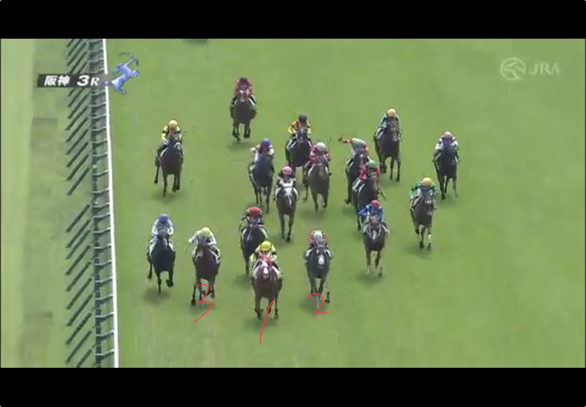
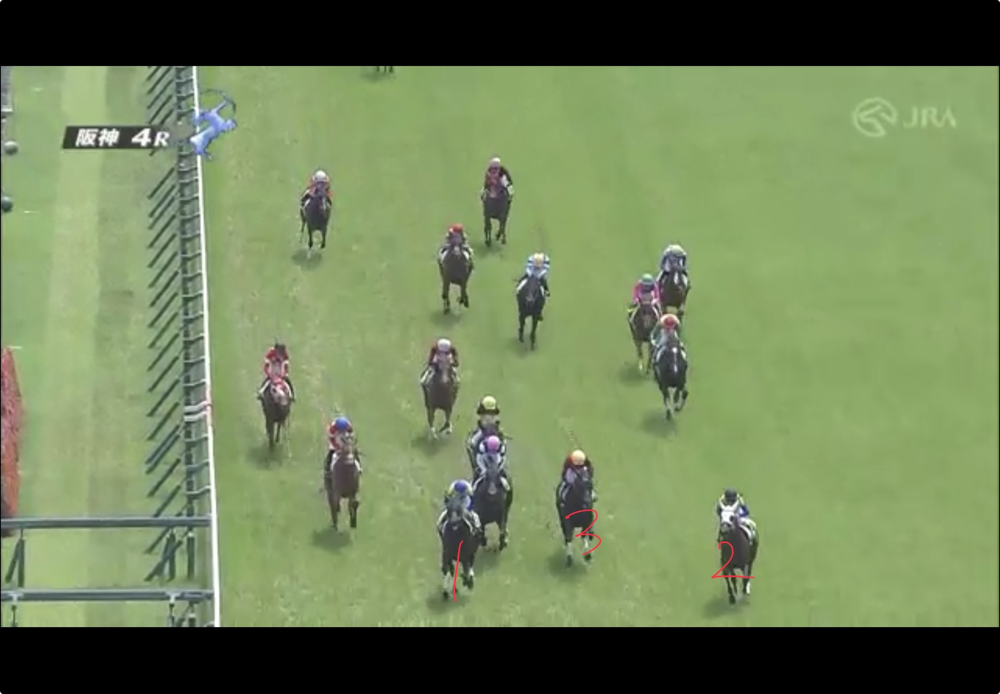
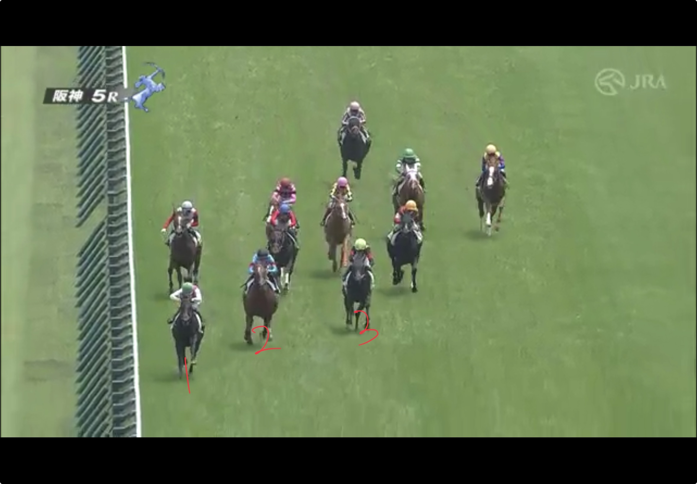
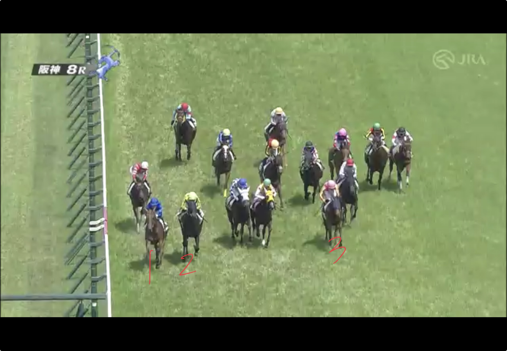
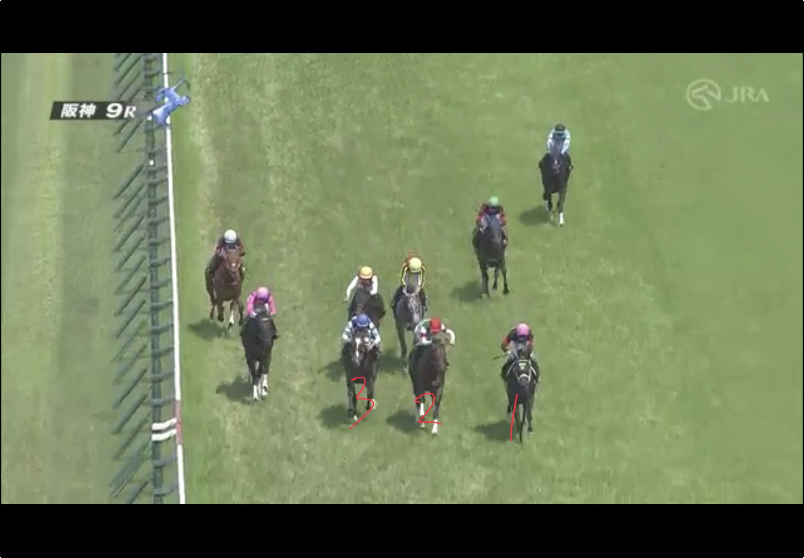
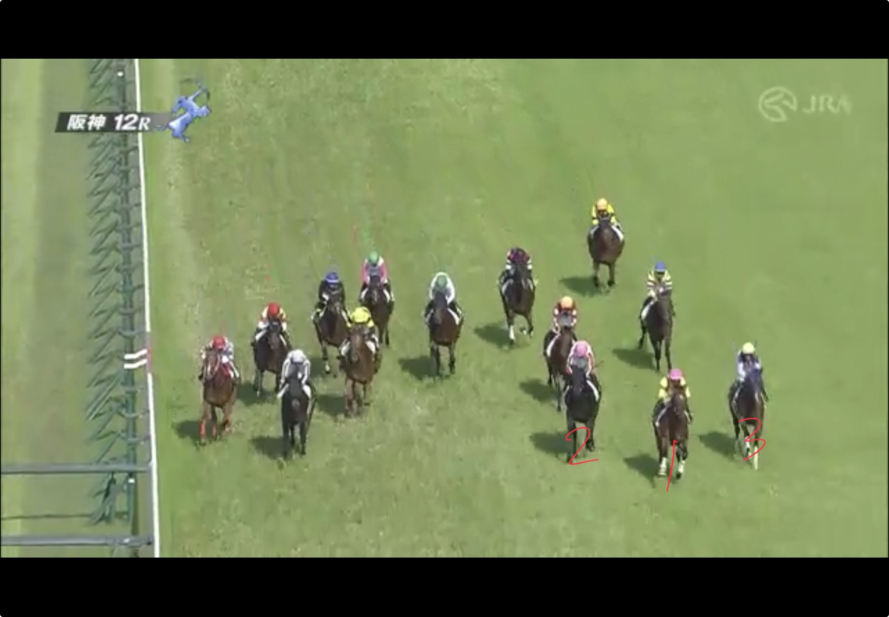

# 宝塚記念2026前日の傾向

開幕2週目で前半は内前が効いていたが、だんだん外差しが決まり始めている。

## 出目

前日の阪神芝で3着以内に入った頭数の出目  

**人気**

| 1人気 | 2人気 | 3人気 | 4-6人気 | 7-9人気 | 10人気以下 |
| --- | --- | --- | --- | --- | --- |
| 5頭 | 1頭 | 1頭 | 7頭 | 1頭 | 3頭 |

**枠番**

> 5枠より外が18頭中11頭を占める

| 1枠 | 2枠 | 3枠 | 4枠 | 5枠 | 6枠 | 7枠 | 8枠 |
| --- | --- | --- | --- | --- | --- | --- | --- |
| 1頭 | 2頭 | 1頭 | 3頭 | 5頭 | 1頭 | 1頭 | 4頭 |

**脚質**

| 逃げ | 先行 | 差し | 追込 |
| --- | --- | --- | --- |
| 2頭 | 7頭 | 5頭 | 4頭 |

**上がり順位**

| 1位 | 2位 | 3位 | 4-6位 | 7-9位 | 10位以下 |
| --- | --- | --- | --- | --- | --- |
| 6頭 | 3頭 | 3頭 | 4頭 | 2頭 | 0頭 |

## 各レース

### 阪神3R 未勝利 1600m 18頭

| 着順 | 枠 | 馬番 | 人気 | 4角通過順位 | 後3ハロン | 後3ハロン順位 |
| --- | --- | --- | --- | --- | --- | --- |
| 1着 | 5枠 | 10番 | 1人気 | 3番手 | 33.8秒 | 4位 |
| 2着 | 1枠 | 1番 | 4人気 | 6番手 | 33.5秒 | 1位 |
| 3着 | 5枠 | 9番 | 11人気 | 2番手 | 34.1秒 | 7位 |

### 阪神4R 未勝利 1800m 16頭

| 着順 | 枠 | 馬番 | 人気 | 4角通過順位 | 後3ハロン | 後3ハロン順位 |
| --- | --- | --- | --- | --- | --- | --- |
| 1着 | 4枠 | 7番 | 1人気 | 3番手 | 35.7秒 | 4位 |
| 2着 | 2枠 | 4番 | 6人気 | 13番手 | 35.1秒 | 1位 |
| 3着 | 7枠 | 13番 | 4人気 | 7番手 | 35.5秒 | 3位 |

### 阪神5R 新馬 1200m 11頭

| 着順 | 枠 | 馬番 | 人気 | 4角通過順位 | 後3ハロン | 後3ハロン順位 |
| --- | --- | --- | --- | --- | --- | --- |
| 1着 | 6枠 | 6番 | 1人気 | 1番手 | 33.8秒 | 2位 |
| 2着 | 2枠 | 2番 | 1人気 | 2番手 | 34.0秒 | 3位 |
| 3着 | 5枠 | 5番 | 7人気 | 5番手 | 33.5秒 | 1位 |

### 阪神8R 1勝クラス 1600m 15頭

> アイニードユーじゃないか！こんなところにいたのか！

| 着順 | 枠 | 馬番 | 人気 | 4角通過順位 | 後3ハロン | 後3ハロン順位 |
| --- | --- | --- | --- | --- | --- | --- |
| 1着 | 4枠 | 6番 | 1人気 | 1番手 | 33.7秒 | 8位 |
| 2着 | 5枠 | 8番 | 4人気 | 2番手 | 33.6秒 | 6位 |
| 3着 | 8枠 | 15番 | 5人気 | 11番手 | 33.1秒 | 1位 |

### 阪神9R 2勝クラス(特別) 2200m 9頭

| 着順 | 枠 | 馬番 | 人気 | 4角通過順位 | 後3ハロン | 後3ハロン順位 |
| --- | --- | --- | --- | --- | --- | --- |
| 1着 | 8枠 | 9番 | 3人気 | 7番手 | 34.5秒 | 1位 |
| 2着 | 3枠 | 3番 | 1人気 | 4番手 | 34.8秒 | 2位 |
| 3着 | 4枠 | 4番 | 4人気 | 4番手 | 34.8秒 | 2位 |

### 阪神12R 1勝クラス 1200m 14頭

> 人気薄の外差しが決まっておりかなり外差しバイアスになってきたか

| 着順 | 枠 | 馬番 | 人気 | 4角通過順位 | 後3ハロン | 後3ハロン順位 |
| --- | --- | --- | --- | --- | --- | --- |
| 1着 | 8枠 | 14番 | 11人気 | 8番手 | 33.5秒 | 3位 |
| 2着 | 8枠 | 13番 | 13人気 | 7番手 | 33.9秒 | 4位 |
| 3着 | 5枠 | 8番 | 4人気 | 14番手 | 32.9秒 | 1位 |

