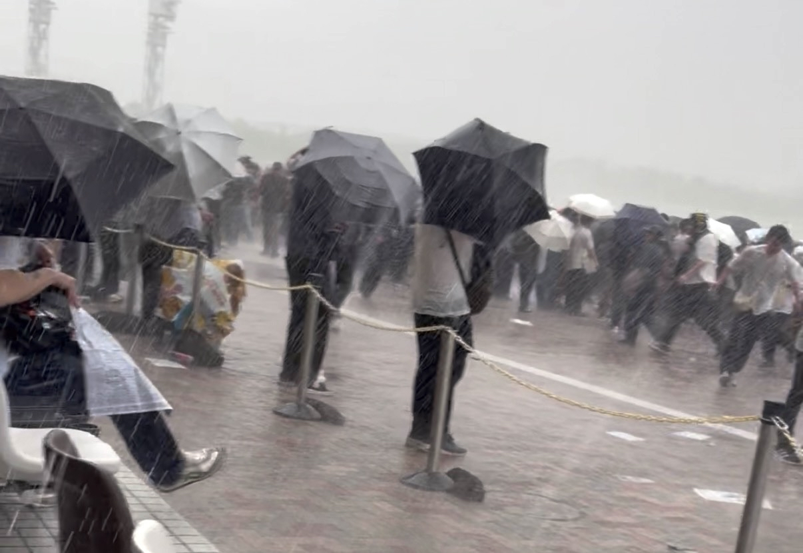
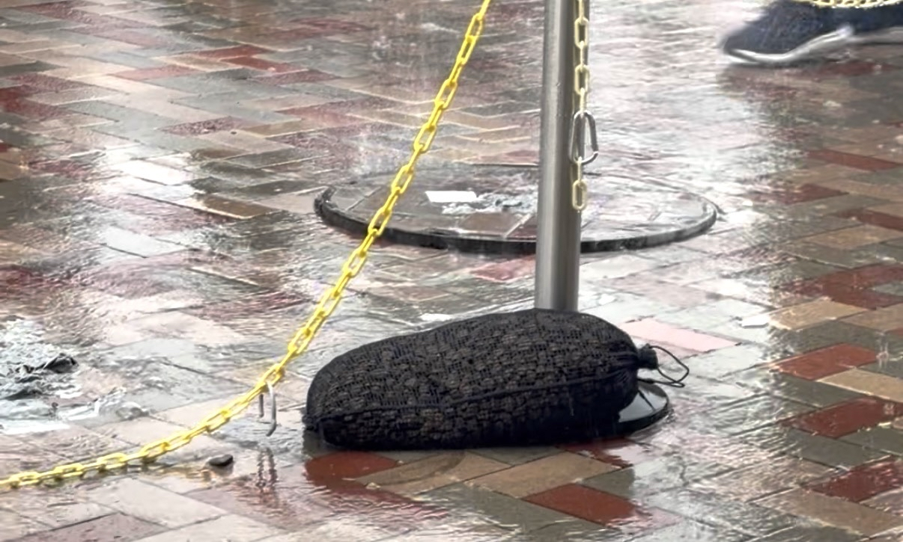
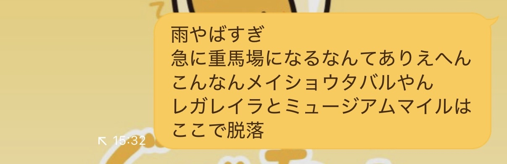
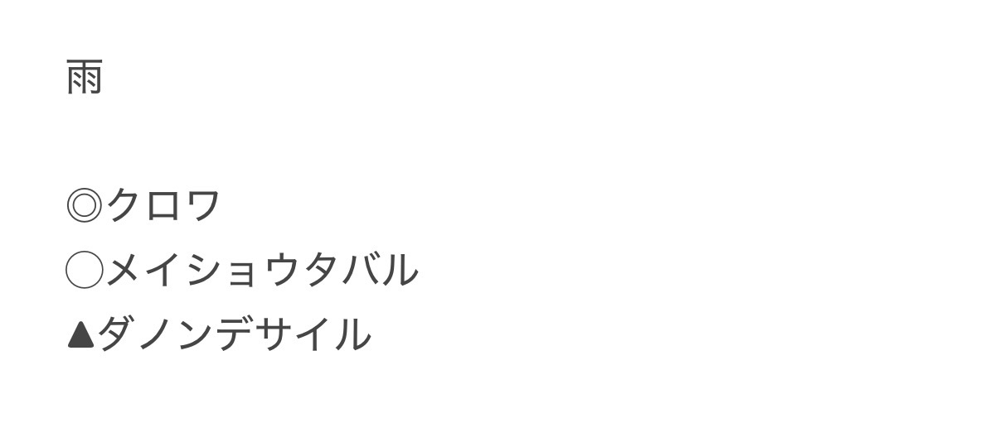

# 宝塚記念2026回顧 ～競馬の予想はまず天気の予想から～

## 結果

1着 注16メイショウタバル  
2着 ◎5クロワデュノール  
3着 ▲1ダノンデサイル

## 総評

**なんですか？これ。**  

滝先生も呆れるほどの滝のような大雨。  
15時20分、レース発走20分前のことである。  

マンホール浮いてますやん。  
あんまりマンホールは浮かないほうがいいですよ。  

奇跡的に指定席が当たったので阪神競馬場に行き、発走1時間ほど前に馬券を購入。  
もちろん良馬場前提の馬券であり、今回タバルのことは軽視していた。  
余裕をもって屋外の指定席で優雅に発走まで待機していたら、このザマである。  
全身びっしょびしょ。  

天気予報は曇りだったはず。  
良馬場前提で馬券を買うのは当然。  
稍重すっ飛ばして重馬場になるなんて聞いてない。  

重馬場ならタバル来ますって。  
そんくらいわかるって。  
重馬場なら買ってるって。  

ネットはつながらないし馬券の買い直しもできないのでレース後の言い訳用に手元でメモを残した。  
ミュージアムマイルとレガレイラがこの馬場で力を発揮できないのは知っている。  
オッズにもあらわれていた。  
結果、重馬場印の3頭で決着。  
自分の馬券が当たらないことを確信しながらレースを見たのは初めて。  

タバル、連覇おめでとう。  
クロワデュノール、惜しかった。  

私は競馬を引退して天気予報士になるために勉強をするので、みなさんは夏競馬頑張ってください。

## 回顧

### 1着 注16メイショウタバル

クビ差1着。  
突然の大雨。レース10分前に良馬場から重馬場に。一気にタバルが勝てる馬場になった。  
レースは逃げ宣言のあったミステリーウェイではなくコスモキュランダが逃げ、タバルは番手に。  
コスモキュランダが大きく離したことで番手でも実質Sペース逃げに。  
重馬場で他馬の脚がそがれたことで上がり3位の末脚でクロワデュノールをしのぎ切った。  
重馬場になったこと、番手でも折り合えたことが勝因。  
これで阪神は4-1-0-0。  
クロワデュノールより前にいてクロワデュノールに先着を許さなかった唯一の馬となった。  

### 2着 ◎5クロワデュノール

クビ差2着。  
突然の重馬場。クロワ自体重馬場を苦にするわけではないが、相対的にタバルに有利な馬場となってしまった。  
道中は3,4番を追走し前有利の展開は向いたが、川田に外からブロックされ続ける不利。  
ここまでしてクビ差で済むのだからすごい。惜しかった。  

### 3着 ▲1ダノンデサイル

0.5秒差3着。  
重馬場で4角1,2,3番手が1,2,4着になる前有利レースでなぜか9番手から上がり最速で追い込んできたバケモン。  
これでG1 3着は5回目。  
重馬場の右回りで展開向かずに3着に来れるなら、もうどんな条件でも馬券内は外さないのでは。  

### 4着 9コスモキュランダ

0.5秒差4着。  
タバルを寄せ付けず後続を離した逃げでダノンデサイルとはアタマ差。  
展開は向きまくったが中山じゃなくてもタフな阪神小回りならやれそう。  
グランプリのたびに人気薄で前の方にいるおもしれー馬。  

### 5着 ☆8タガノデュード

1.4秒差5着。  
4角1,2,3番手が1,2,4着になる前有利を4角16番手から5着に来るバケモン。  
クロワデュノールと共に春古馬三冠を完走。  
大阪杯G1昇格後はキタサンブラック、スマートレーヤー、ジャスティンパレス含めて史上5頭目の快挙。  
着順も4→6→5着と活躍十分で、G1馬不在のG2,G3程度ならそのうち勝てそう。  

### 6着 7ファミリータイム

1.4秒差6着。  
18番人気にしては大健闘。  
過去重場3回走って2回馬券になってるので得意だったか。  
4角1,2,3番手が1,2,4着になる前有利レースで4角7番手だったので展開はやや向いている。  

### 7着 ○17レガレイラ

1.6秒差7着。  
突然の重馬場に泣く。  
4角1,2,3番手が1,2,4着になる前有利を10番手からではどうしようもない。  
度外視でいい。  

### 8着 10ジューンテイク

1.6秒差8着。  
4角1,2,3番手が1,2,4着になる前有利レースで4角3番手外だったので展開は向いていた。  

### 9着 △2ミュージアムマイル

1.6秒差9着。  
突然の重馬場に泣く。  
高速馬場専用機なので度外視でいい。  
本当に状態が悪かったのかどうかは不明。  

### 10着 12マイネルエンペラー

1.7秒差10着。  
4角1,2,3番手が1,2,4着になる前有利レースで4角3番手だったので展開向いていた。  
クロワデュノールをブロックするだけして直線では後退していった。  
川田はクロワをブロックすればこの馬で勝てると思ってたのだろうか。  

### 11着 11シンエンペラー

2.1秒差11着。  
4角1,2,3番手が1,2,4着になる前有利を15番手からではどうしようもない。  
度外視でいい。  
こいついっつも展開向いてないな。  

### 12着 4ミクニインスパイア

2.4秒差12着。  
重馬場で4角1,2,3番手が1,2,4着になる前有利を11番手からではどうしようもない。  
度外視でいい。  

### 13着 14スティンガーグラス

2.7秒差13着。  
重馬場で4角1,2,3番手が1,2,4着になる前有利を17番手からではどうしようもない。  
度外視でいい。  

### 14着 13シェイクユアハート

2.8秒差14着。  
重馬場で4角1,2,3番手が1,2,4着になる前有利を11番手からではどうしようもない。  
度外視でいい。  

### 15着 6ビザンチンドリーム

3.0秒差15着。  
やや出遅れ。  
重馬場で4角1,2,3番手が1,2,4着になる前有利を17番手からではどうしようもない。  
度外視でいい。  
ただフォア賞や凱旋門賞でのパフォーマンスを考えると若干物足りないか。  

### 16着 18ミステリーウェイ

3.1秒差16着。  
逃げ宣言するも逃げず。  
好スタートもテンが速いわけではないようで少なくとも2400mはないと逃げられないっぽい。  
途中からでもとにかく逃げろと言っていたのはなんだったのか。  
重馬場で4角1,2,3番手が1,2,4着になる前有利を17番手からではどうしようもなかった。  

### 17着 3シュガークン

3.2秒差17着。  
4角1,2,3番手が1,2,4着になる前有利を4角7番手だったので展開不利ではなかった。  
13着以下がみんな後方で展開向かなかった馬だったことを考えると物足りない。  
