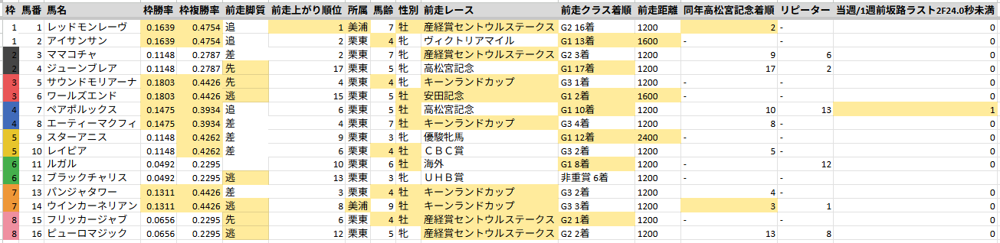
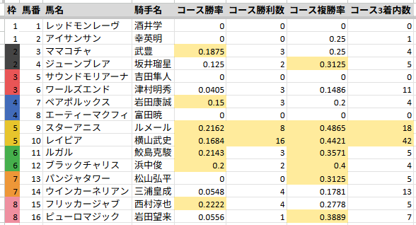
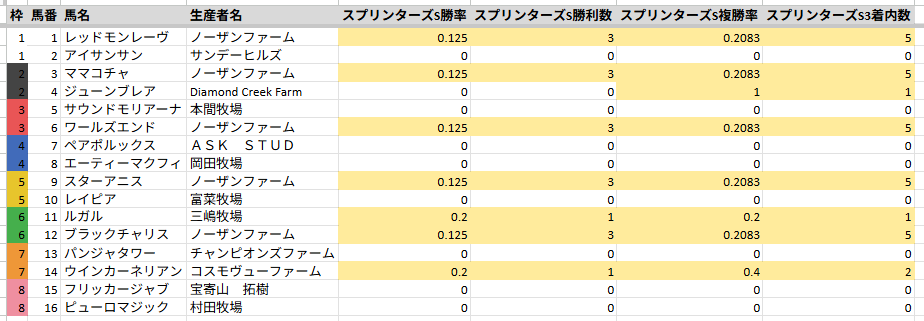
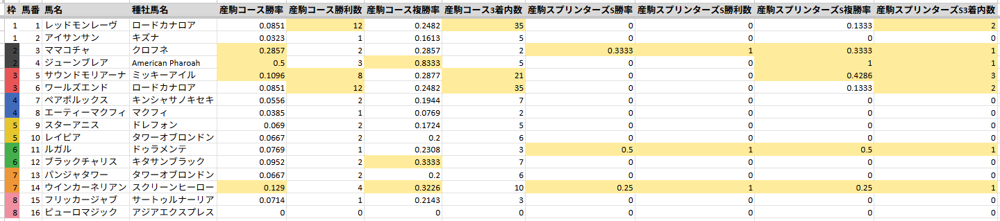

# スプリンターズS2026傾向分析

## 出走馬傾向

過去10年出走馬に関する傾向

### 枠順

> 内枠優勢

| 枠順 | 着度数 | 勝率 | 複率 | 単回 | 複回 |
| --- | --- | --- | --- | --- | --- |
| 1枠 | 1-2-4-13 | 5% | 35% | 102% | 178% |
| 2枠 | 1-1-1-17 | 5% | 15% | 26% | 56% |
| 3枠 | 1-0-4-15 | 5% | 25% | 24% | 80% |
| 4枠 | 3-2-0-15 | 15% | 25% | 44% | 56% |
| 5枠 | 1-2-0-17 | 5% | 15% | 11% | 48% |
| 6枠 | 0-1-0-19 | 0% | 5% | 0% | 8% |
| 7枠 | 2-1-0-16 | 11% | 16% | 198% | 86% |
| 8枠 | 1-1-1-17 | 5% | 15% | 250% | 111% |

### 人気

> 荒れるイメージがある

| 人気 | 着度数 | 勝率 | 複率 | 単回 | 複回 |
| --- | --- | --- | --- | --- | --- |
| 1人気 | 3-0-2-5 | 30% | 50% | 82% | 69% |
| 2人気 | 1-2-1-6 | 10% | 40% | 29% | 79% |
| 3人気 | 3-2-0-5 | 30% | 50% | 194% | 112% |
| 4-6人気 | 0-3-2-25 | 0% | 17% | 0% | 62% |
| 7-9人気 | 2-2-2-23 | 7% | 21% | 168% | 115% |
| 10人気以下 | 1-1-3-65 | 1% | 7% | 71% | 66% |

### 脚質

> 差しも届くが、先行馬が好走率・回収率共に優秀

| 脚質 | 着度数 | 勝率 | 複率 | 単回 | 複回 |
| --- | --- | --- | --- | --- | --- |
| 逃げ | 0-3-1-6 | 0% | 40% | 0% | 136% |
| 先行 | 5-4-2-24 | 14% | 31% | 311% | 175% |
| 差し | 4-3-4-50 | 7% | 18% | 30% | 53% |
| 追込 | 1-0-3-49 | 2% | 8% | 4% | 32% |

### 前走脚質

> 前走差しの方が優勢も、実際は先行馬の方が成績がいいためたまたまか？

| 前走脚質 | 着度数 | 勝率 | 複率 | 単回 | 複回 |
| --- | --- | --- | --- | --- | --- |
| 逃げ | 1-1-1-15 | 6% | 17% | 278% | 117% |
| 先行 | 0-6-2-29 | 0% | 22% | 0% | 86% |
| 差し | 7-3-4-38 | 13% | 27% | 129% | 99% |
| 追込 | 2-0-3-37 | 5% | 12% | 30% | 47% |

### 上がり3F順位

> 上がりは使えるに越したことはない

| 上がり3F順位 | 着度数 | 勝率 | 複率 | 単回 | 複回 |
| --- | --- | --- | --- | --- | --- |
| 1位 | 1-0-3-7 | 9% | 36% | 20% | 110% |
| 2位 | 2-0-2-10 | 14% | 29% | 61% | 128% |
| 3位 | 2-2-0-5 | 22% | 44% | 63% | 129% |
| 4位以下 | 5-8-5-107 | 4% | 14% | 90% | 66% |

### 前走上がり3F順位

> あまり関係なさそう

| 前走上がり3F順位 | 着度数 | 勝率 | 複率 | 単回 | 複回 |
| --- | --- | --- | --- | --- | --- |
| 1位 | 3-0-1-16 | 15% | 20% | 72% | 40% |
| 2位 | 0-1-1-16 | 0% | 11% | 0% | 58% |
| 3位 | 2-1-0-13 | 12% | 19% | 38% | 50% |
| 4位以下 | 5-8-8-81 | 5% | 21% | 107% | 96% |

### 所属

> 美浦が母数の割りに優秀

| 所属 | 着度数 | 勝率 | 複率 | 単回 | 複回 |
| --- | --- | --- | --- | --- | --- |
| 美浦 | 5-2-2-27 | 14% | 25% | 188% | 106% |
| 栗東 | 5-8-8-98 | 4% | 18% | 52% | 72% |
| 地方 | 0-0-0-0 | - | - | - | - |
| 海外 | 0-0-0-4 | 0% | 0% | 0% | 0% |

### 馬齢

> 4歳が主役

| 馬齢 | 着度数 | 勝率 | 複率 | 単回 | 複回 |
| --- | --- | --- | --- | --- | --- |
| 3歳 | 1-2-1-15 | 5% | 21% | 28% | 103% |
| 4歳 | 4-4-4-26 | 11% | 32% | 101% | 96% |
| 5歳 | 2-4-1-37 | 5% | 16% | 27% | 45% |
| 6歳 | 1-0-3-28 | 3% | 12% | 10% | 52% |
| 7歳以上 | 2-0-1-23 | 8% | 12% | 270% | 120% |

### 性別

> 牝馬も頑張ってはいる

| 性別 | 着度数 | 勝率 | 複率 | 単回 | 複回 |
| --- | --- | --- | --- | --- | --- |
| 牡 | 8-5-4-78 | 8% | 18% | 129% | 84% |
| 牝 | 2-5-6-45 | 3% | 22% | 12% | 76% |
| セン | 0-0-0-6 | 0% | 0% | 0% | 0% |

### 前走レース

> セントウルS、キーンランドC、北九州記念が主要ローテ。
> 安田記念はメンバーレベルと距離短縮が効いてか出走数は少ないも好走率が高い。

| 前走レース | 着度数 | 勝率 | 複率 | 単回 | 複回 |
| --- | --- | --- | --- | --- | --- |
| 産経賞セントウルステークス | 3-4-1-44 | 6% | 15% | 21% | 60% |
| キーンランドカップ | 1-1-4-35 | 2% | 15% | 122% | 75% |
| テレビ西日本賞北九州記念 | 2-1-1-17 | 10% | 19% | 120% | 72% |
| 安田記念 | 2-0-1-4 | 29% | 43% | 77% | 120% |
| ＣＢＣ賞 | 1-2-0-2 | 20% | 60% | 184% | 248% |
| 高松宮記念 | 1-1-0-2 | 25% | 50% | 712% | 252% |
| ヴィクトリアマイル | 0-1-0-1 | 0% | 50% | 0% | 150% |
| 函館スプリントステークス | 0-0-1-4 | 0% | 20% | 0% | 42% |
| 京成杯オータムハンデキャップ | 0-0-0-1 | 0% | 0% | 0% | 0% |
| 京王杯スプリングカップ | 0-0-0-2 | 0% | 0% | 0% | 0% |
| 優駿牝馬 | 0-0-0-1 | 0% | 0% | 0% | 0% |
| アイビスサマーダッシュ | 0-0-0-4 | 0% | 0% | 0% | 0% |
| エルムステークス | 0-0-0-1 | 0% | 0% | 0% | 0% |
| その他 | 0-0-2-11 | 0% | 15% | 0% | 86% |

### 前走クラス

> 前走G1が好走率・回収率共に優秀

| 前走クラス | 着度数 | 勝率 | 複率 | 単回 | 複回 |
| --- | --- | --- | --- | --- | --- |
| G1 | 3-2-1-14 | 15% | 30% | 170% | 108% |
| G2 | 3-4-1-46 | 6% | 15% | 20% | 57% |
| G3 | 4-4-6-66 | 5% | 18% | 106% | 75% |
| その他 | 0-0-2-3 | 0% | 40% | 0% | 224% |

### 前走着順

> 掲示板は欲しいか

| 前走着順 | 着度数 | 勝率 | 複率 | 単回 | 複回 |
| --- | --- | --- | --- | --- | --- |
| 1着 | 4-3-3-22 | 12% | 31% | 53% | 66% |
| 2着 | 2-4-0-25 | 6% | 19% | 33% | 72% |
| 3着 | 1-0-1-11 | 8% | 15% | 25% | 63% |
| 4着 | 0-1-1-5 | 0% | 29% | 0% | 131% |
| 5着 | 1-0-3-4 | 12% | 50% | 625% | 465% |
| 6-9着 | 0-1-2-32 | 0% | 9% | 0% | 31% |
| 10着以下 | 2-1-0-30 | 6% | 9% | 148% | 45% |

### 前走G1着順

> G1なら大敗も許容

| 前走G1着順 | 着度数 | 勝率 | 複率 | 単回 | 複回 |
| --- | --- | --- | --- | --- | --- |
| 1着 | 1-0-0-0 | 100% | 100% | 220% | 140% |
| 2着 | 0-1-0-2 | 0% | 33% | 0% | 97% |
| 3着 | 1-0-0-0 | 100% | 100% | 320% | 140% |
| 4着 | 0-0-0-1 | 0% | 0% | 0% | 0% |
| 5着 | 0-0-0-1 | 0% | 0% | 0% | 0% |
| 6-9着 | 0-0-1-3 | 0% | 25% | 0% | 140% |
| 10着以下 | 1-1-0-7 | 11% | 22% | 317% | 113% |

### 前走G2着順

> 掲示板は必須

| 前走G2着順 | 着度数 | 勝率 | 複率 | 単回 | 複回 |
| --- | --- | --- | --- | --- | --- |
| 1着 | 2-3-0-6 | 18% | 45% | 52% | 90% |
| 2着 | 1-1-0-8 | 10% | 20% | 53% | 71% |
| 3着 | 0-0-0-6 | 0% | 0% | 0% | 0% |
| 4着 | 0-0-0-2 | 0% | 0% | 0% | 0% |
| 5着 | 0-0-1-2 | 0% | 33% | 0% | 467% |
| 6-9着 | 0-0-0-15 | 0% | 0% | 0% | 0% |
| 10着以下 | 0-0-0-7 | 0% | 0% | 0% | 0% |

### 前走G3着順

> 稀に巻き返しもあり

| 前走G3着順 | 着度数 | 勝率 | 複率 | 単回 | 複回 |
| --- | --- | --- | --- | --- | --- |
| 1着 | 1-0-2-15 | 6% | 17% | 51% | 36% |
| 2着 | 1-2-0-13 | 6% | 19% | 31% | 77% |
| 3着 | 0-0-1-5 | 0% | 17% | 0% | 113% |
| 4着 | 0-1-1-2 | 0% | 50% | 0% | 230% |
| 5着 | 1-0-1-1 | 33% | 67% | 1667% | 517% |
| 6-9着 | 0-1-1-14 | 0% | 12% | 0% | 33% |
| 10着以下 | 1-0-0-16 | 6% | 6% | 119% | 28% |

### 前走非重賞着順

> 母数が少ないのでなんとも言えないが、勝利はしていて欲しい

| 前走非重賞着順 | 着度数 | 勝率 | 複率 | 単回 | 複回 |
| --- | --- | --- | --- | --- | --- |
| 1着 | 0-0-1-1 | 0% | 50% | 0% | 175% |
| 2着 | 0-0-0-2 | 0% | 0% | 0% | 0% |
| 3着 | 0-0-0-0 | - | - | - | - |
| 4着 | 0-0-0-0 | - | - | - | - |
| 5着 | 0-0-1-0 | 0% | 100% | 0% | 770% |
| 6-9着 | 0-0-0-0 | - | - | - | - |
| 10着以下 | 0-0-0-0 | - | - | - | - |

### 前走距離

> 距離短縮が優勢。1400m適性が求められる？

| 前走距離 | 着度数 | 勝率 | 複率 | 単回 | 複回 |
| --- | --- | --- | --- | --- | --- |
| 距離延長 | 0-0-0-4 | 0% | 0% | 0% | 0% |
| 同距離 | 8-9-7-113 | 6% | 18% | 90% | 74% |
| 距離短縮 | 2-1-3-12 | 11% | 33% | 30% | 126% |

### 中山重賞好走実績

> 中山実績はなくてもいい

| 中山重賞好走実績 | 着度数 | 勝率 | 複率 | 単回 | 複回 |
| --- | --- | --- | --- | --- | --- |
| 0回 | 8-7-7-89 | 7% | 20% | 95% | 90% |
| 1回 | 1-2-2-24 | 3% | 17% | 11% | 53% |
| 2回 | 0-1-1-10 | 0% | 17% | 0% | 32% |
| 3回以上 | 1-0-0-6 | 14% | 14% | 290% | 67% |

### リピーター

> リピーターレースではない

| リピーター | 着度数 | 勝率 | 複率 | 単回 | 複回 |
| --- | --- | --- | --- | --- | --- |
| 前年3着以内 | 1-1-2-14 | 6% | 22% | 18% | 46% |
| 前年4着以内 | 1-2-2-20 | 4% | 20% | 13% | 45% |
| 前年5着以内 | 1-2-3-24 | 3% | 20% | 11% | 42% |
| 前年6着以下 | 2-1-0-24 | 7% | 11% | 86% | 34% |
| 前年出走無し | 7-7-7-81 | 7% | 21% | 101% | 100% |

### 同年高松宮記念着順

> 強い馬は高松宮記念もスプリンターズSも好走するが、求められる適性が異なるので掲示板外からの巻き返しも多い。

| 同年高松宮記念着順 | 着度数 | 勝率 | 複率 | 単回 | 複回 |
| --- | --- | --- | --- | --- | --- |
| 3着以内 | 3-3-4-13 | 13% | 43% | 36% | 104% |
| 4着以内 | 3-3-5-17 | 11% | 39% | 29% | 90% |
| 5着以内 | 3-3-5-19 | 10% | 37% | 27% | 84% |
| 6着以下 | 2-3-3-35 | 5% | 19% | 113% | 101% |
| 出走無し | 5-4-2-75 | 6% | 13% | 84% | 64% |

### 当週/1週前坂路ラスト2F24.0秒未満

> とりあえず買っておいていいレベル

| 当週/1週前坂路ラスト2F24.0秒未満 | 着度数 | 勝率 | 複率 | 単回 | 複回 |
| --- | --- | --- | --- | --- | --- |
| 該当 | 2-3-1-10 | 12% | 38% | 305% | 152% |
| 非該当 | 8-7-9-102 | 6% | 19% | 64% | 79% |
| 坂路記録なし | 0-0-0-17 | 0% | 0% | 0% | 0% |

### 比較表

> 美浦、内枠先行、前走G1出走かG2勝ち、距離短縮、坂路抜群

- ワールズエンド
- ペアポルックス

※枠勝率、複勝率は過去5年中山芝1200m2週目の集計

## 騎手傾向

過去10年騎手に関する傾向

### 騎手

| 騎手 | 着度数 | 勝率 | 複率 | 単回 | 複回 |
| --- | --- | --- | --- | --- | --- |
| ルメール | 2-1-1-2 | 33% | 67% | 85% | 107% |
| 西村淳也 | 1-0-0-2 | 33% | 33% | 950% | 240% |
| 三浦皇成 | 1-0-0-4 | 20% | 20% | 1000% | 250% |
| 松山弘平 | 0-2-1-3 | 0% | 50% | 0% | 247% |
| 武豊　　 | 0-1-1-5 | 0% | 29% | 0% | 277% |
| 坂井瑠星 | 0-1-0-2 | 0% | 33% | 0% | 107% |
| 岩田康誠 | 0-1-0-5 | 0% | 17% | 0% | 50% |
| 吉田隼人 | 0-0-1-0 | 0% | 100% | 0% | 770% |
| 横山武史 | 0-0-1-3 | 0% | 25% | 0% | 75% |
| 浜中俊　 | 0-0-1-6 | 0% | 14% | 0% | 20% |
| 津村明秀 | 0-0-0-0 | - | - | - | - |
| 酒井学　 | 0-0-0-1 | 0% | 0% | 0% | 0% |
| 富田暁　 | 0-0-0-1 | 0% | 0% | 0% | 0% |
| 幸英明　 | 0-0-0-2 | 0% | 0% | 0% | 0% |
| 鮫島克駿 | 0-0-0-2 | 0% | 0% | 0% | 0% |
| 岩田望来 | 0-0-0-2 | 0% | 0% | 0% | 0% |

### 比較表

> ルメール、武史

- スターアニス
- レイピア

※過去5年中山芝1200m

## 生産者傾向

過去10年生産者に関する傾向

### 生産者

| 生産者 | 着度数 | 勝率 | 複率 | 単回 | 複回 |
| --- | --- | --- | --- | --- | --- |
| ノーザンファーム | 3-2-1-20 | 12% | 23% | 48% | 64% |
| コスモヴューファーム | 1-1-0-3 | 20% | 40% | 1000% | 352% |
| 三嶋牧場 | 1-0-0-4 | 20% | 20% | 570% | 144% |
| Diamond Creek Farm | 0-1-0-0 | 0% | 100% | 0% | 540% |
| 本間牧場 | 0-0-0-0 | - | - | - | - |
| 岡田牧場 | 0-0-0-0 | - | - | - | - |
| 富菜牧場 | 0-0-0-0 | - | - | - | - |
| チャンピオンズファーム | 0-0-0-0 | - | - | - | - |
| 宝寄山　拓樹 | 0-0-0-0 | - | - | - | - |
| サンデーヒルズ | 0-0-0-1 | 0% | 0% | 0% | 0% |
| ＡＳＫ　ＳＴＵＤ | 0-0-0-1 | 0% | 0% | 0% | 0% |
| 村田牧場 | 0-0-0-2 | 0% | 0% | 0% | 0% |

### 比較表

> ノーザンファーム最強

- レッドモンレーヴ
- ママコチャ
- ワールズエンド
- スターアニス
- ブラックチャリス

※過去5年中山芝1200m

## 血統傾向

過去10年血統に関する傾向

### 種牡馬

| 種牡馬 | 着度数 | 勝率 | 複率 | 単回 | 複回 |
| --- | --- | --- | --- | --- | --- |
| スウェプトオーヴァーボード | 2-0-1-1 | 50% | 75% | 310% | 480% |
| ミッキーアイル | 0-0-3-4 | 0% | 43% | 0% | 93% |
| アドマイヤムーン | 1-0-1-6 | 12% | 25% | 35% | 62% |
| ダイワメジャー | 0-1-1-3 | 0% | 40% | 0% | 180% |
| ディープインパクト | 1-1-0-5 | 14% | 29% | 31% | 61% |
| ロードカナロア | 0-1-1-13 | 0% | 13% | 0% | 20% |
| その他 | 6-7-3-97 | 5% | 14% | 99% | 68% |

### 比較表

> ロードカナロア、ミッキーアイルが母数、好走率ともに優秀

- レッドモンレーヴ
- サウンドモリアーナ
- ワールズエンド

※過去5年中山芝1200m
