# 【スプリンターズS2026】前日の傾向

## 前日の出目

各要素において、前日のレースのうちスプリンターズSと同じ競馬場、芝ダのレースで3着以内に入った頭数を集計。

**人気**

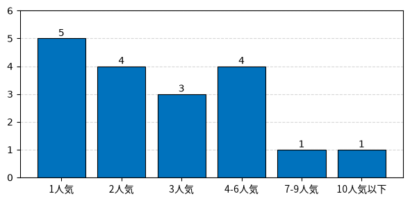

**枠番**

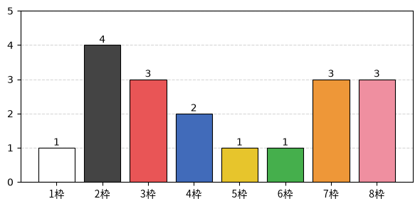

**[脚質](http://next5.jra-van.jp/appli/kyakushitsu3.html)**

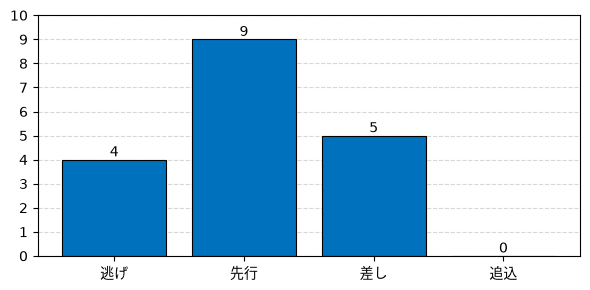

**上がり順位**

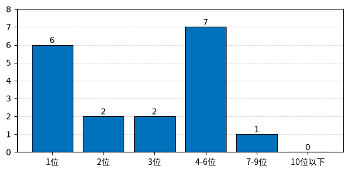

## 展開有利度の傾向

差し有利度・外枠有利度・外有利度は、それぞれ4角通過位置・馬番・コーナーでの内外の位置と走破タイムの相関係数を100倍したもの。正なら差し・外枠・外を回した馬が有利。

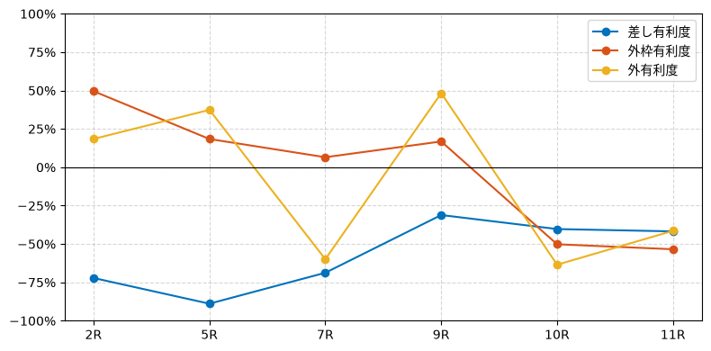

## 各レースの結果

### 中山2R 未勝利 1600m 12頭

| 着順 | 枠番 | 人気 | 4角通過 | 後3F |
| --- | --- | --- | --- | --- |
| 1着 | 8枠 11番 | 4人気 | 3番手 (先) | 35.8秒 (1位) |
| 2着 | 7枠 10番 | 3人気 | 3番手 (先) | 37.1秒 (5位) |
| 3着 | 6枠 8番 | 2人気 | 6番手 (差) | 36.8秒 (3位) |

| 差し有利度 | 外枠有利度 | 外有利度 |
| --- | --- | --- |
| -72% | +50% | +18% |

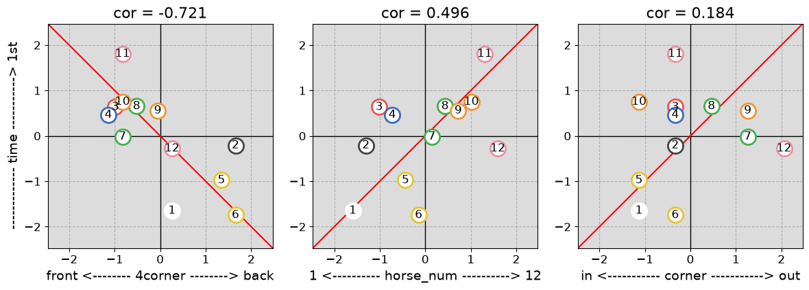

### 中山5R 新馬 1800m 14頭

| 着順 | 枠番 | 人気 | 4角通過 | 後3F |
| --- | --- | --- | --- | --- |
| 1着 | 3枠 4番 | 4人気 | 2番手 (先) | 36.0秒 (1位) |
| 2着 | 7枠 12番 | 1人気 | 3番手 (先) | 36.0秒 (1位) |
| 3着 | 4枠 6番 | 3人気 | 1番手 (逃) | 36.8秒 (4位) |

| 差し有利度 | 外枠有利度 | 外有利度 |
| --- | --- | --- |
| -89% | +18% | +37% |

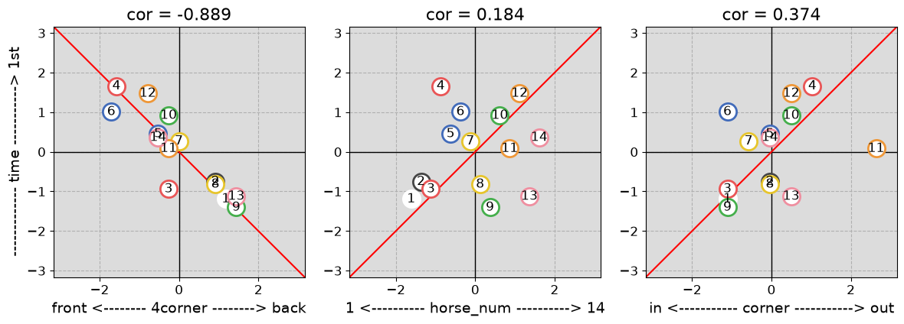

### 中山7R 1勝クラス 2000m 18頭

| 着順 | 枠番 | 人気 | 4角通過 | 後3F |
| --- | --- | --- | --- | --- |
| 1着 | 3枠 6番 | 1人気 | 2番手 (先) | 36.7秒 (1位) |
| 2着 | 7枠 13番 | 8人気 | 1番手 (逃) | 37.3秒 (4位) |
| 3着 | 8枠 16番 | 2人気 | 5番手 (差) | 37.6秒 (5位) |

| 差し有利度 | 外枠有利度 | 外有利度 |
| --- | --- | --- |
| -69% | +7% | -60% |

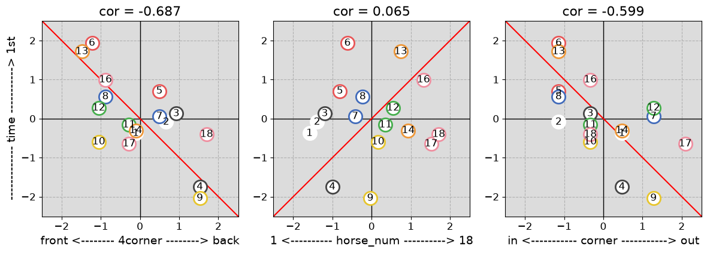

### 中山9R オープン(特別) 2000m 8頭

| 着順 | 枠番 | 人気 | 4角通過 | 後3F |
| --- | --- | --- | --- | --- |
| 1着 | 8枠 8番 | 2人気 | 3番手 (先) | 36.8秒 (1位) |
| 2着 | 4枠 4番 | 4人気 | 1番手 (逃) | 37.5秒 (4位) |
| 3着 | 2枠 2番 | 1人気 | 2番手 (先) | 37.5秒 (4位) |

| 差し有利度 | 外枠有利度 | 外有利度 |
| --- | --- | --- |
| -31% | +17% | +48% |

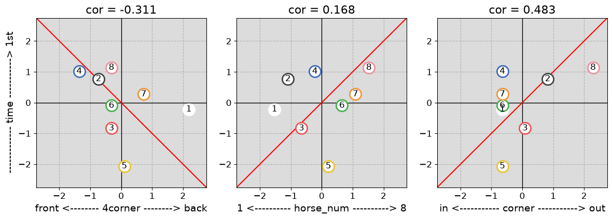

### 中山10R 2勝クラス(特別) 1200m 16頭

| 着順 | 枠番 | 人気 | 4角通過 | 後3F |
| --- | --- | --- | --- | --- |
| 1着 | 2枠 4番 | 11人気 | 6番手 (差) | 35.0秒 (2位) |
| 2着 | 2枠 3番 | 5人気 | 3番手 (先) | 35.3秒 (4位) |
| 3着 | 1枠 2番 | 1人気 | 1番手 (逃) | 35.9秒 (9位) |

| 差し有利度 | 外枠有利度 | 外有利度 |
| --- | --- | --- |
| -40% | -50% | -63% |

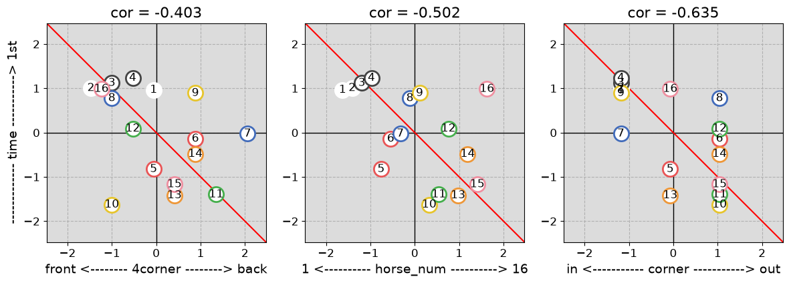

### 中山11R 3勝クラス(特別) 1600m 14頭

| 着順 | 枠番 | 人気 | 4角通過 | 後3F |
| --- | --- | --- | --- | --- |
| 1着 | 2枠 2番 | 1人気 | 3番手 (先) | 35.8秒 (1位) |
| 2着 | 3枠 3番 | 3人気 | 5番手 (差) | 35.9秒 (2位) |
| 3着 | 5枠 8番 | 2人気 | 5番手 (差) | 36.1秒 (3位) |

| 差し有利度 | 外枠有利度 | 外有利度 |
| --- | --- | --- |
| -42% | -53% | -41% |

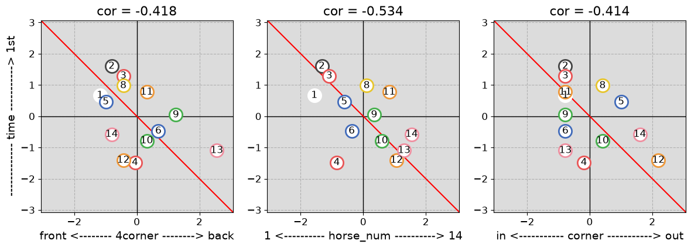
