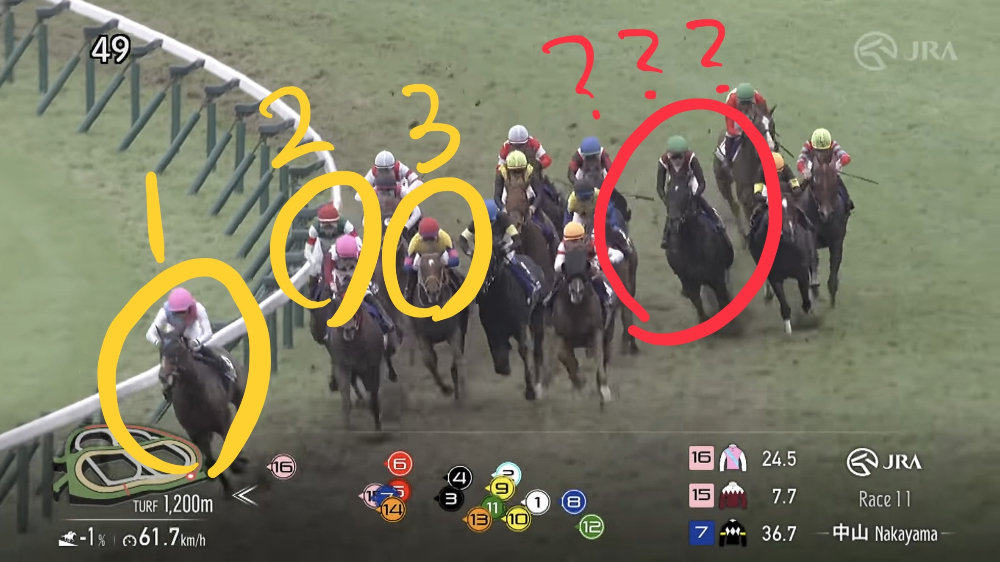
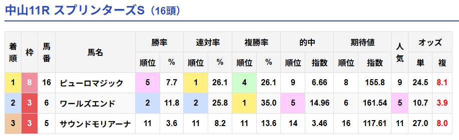

# 【スプリンターズS2026】回顧

予想記事は[こちら](https://kubotech.hatenadiary.com/entry/2026/09/27/141757)

## 結果

1着 注16ピューロマジック  
2着 △6ワールズエンド  
3着 5サウンドモリアーナ

## 総評

みんな嘘つき！

ハイペース想定とはなんだったのか？  
今までピューロマジックがハイペースで逃げてたのはすべて今回のためのブラフだったようだ。  
ついてったら自滅するとわかって結局誰も競りかけずに単騎で楽逃げを決めてしまう。  
前半3ハロンは前日の重馬場の2勝クラスと0.4秒しか変わらないし勝ちタイム1:09.2は0.5秒しか変わらない。なんなら当日の新馬戦とも0.7秒しか変わらない。G1やぞ。遅すぎる。完全に騙された。  
ピューロマジックさん、噓をつかないでください。

夏の3戦で消耗している、中山は合ってないとはなんだったのか？  
安田翔伍さん、嘘をつかないでください。

外がよくなってきているとはなんだったのか？  
C.ルメールさん、嘘をつかないでください。

サメカツは…嘘はついてないか。  
まあ今回はサメカツが悪いかというとそうでもないので許しますが、やはりG1未勝利騎手をG1でわざわざ本命にする理由も特にないので、G1未勝利騎手をG1で本命にしない教に戻ろうと思います。  
サメカツ、今までありがとう。  
G1勝ったら出直してきてくれ。

---

ちなみに自作AIは9人気→5人気ながら連対率のワンツーフィニッシュ。  
もっと早く教えてくれ。

🤖 < 人類は愚かだからAIに従えばいいのに…

## 回顧

### 1着 注16ピューロマジック

クビ差1着。  
先行馬が多く前でやりあうと自滅する可能性があるとジョッキーもわかっていたのか、誰もピューロマジックに競りかけることなく大外からハナを取り切る。  
前半3ハロンは33.5秒で、稍重なことを考えてもピューロマジックにしてはかなり遅い。  
結果的に楽逃げが叶い、4角では3馬身のリードでそのまま先頭を譲ることなくゴールイン。  
もちろん強かったが勝ちタイム1:09.2は過去10年で最遅で、ピューロ自身もラストは11.6, 12.6と失速していることから、ピューロが強かったというより他の馬がタフ馬場で削られすぎたと見る。  

### 2着 △6ワールズエンド

クビ差2着。  
ピューロの楽逃げに乗っかり、内枠からスムーズに先行。  
4角3番手以内の3頭で決まる超内前有利展開が向いた。  

### 3着 5サウンドモリアーナ

クビハナ差3着。  
ピューロの楽逃げに乗っかり、内枠からスムーズに先行。  
4角3番手以内の3頭で決まる超内前有利展開が向いた。  

### 4着 ○9スターアニス

0.2秒差4着。  
4角3番手以内の3頭で決まる超内前有利展開を道中外回し4角10番手から上がり2位で4着まで来ており、今回最も強い競馬をした。  
馬場も特殊だったことを考えると全く悲観する必要はなく、次走以降もスプリントで期待できる。  

### 5着 1レッドモンレーヴ

0.4秒差5着。  
4角3番手以内の3頭で決まる超内前有利展開を、道中最内を立ち回ったとはいえ4角最後方14番手から上がり最速で掲示板入りしており強かった。  
追い込み馬なので展開待ちになるのは仕方ないが、高松宮記念で2着の実績がありながら14番人気52.3倍は舐められすぎていた。  
直線では進路を無理やりこじ開けるシーンがあり、ロスがなければスターアニスには迫っていたかもしれない。  

### 6着 ◆14ウインカーネリアン

0.4秒差6着。  
4角3番手以内の3頭で決まる超内前有利展開で4角3番手集団にいたものの、道中終始外を回されていたのが厳しかった。  
6着に残せているなら十分で、現役を続行するのであればまだG1でも狙える。  

### 7着 ☆8エーティーマクフィ

0.5秒差7着。  
4角3番手以内の3頭で決まる超内前有利展開を14番手から上がり3位で7着まで追い上げており着順以上に強かった。  
直線ではレッドモンレーヴに衝突される不利があり、なければ掲示板は入れたかもしれない。  

### 8着 ☆4ジューンブレア

0.5秒差8着。  
好スタートも外から被されるのを嫌ってか手綱を引いてしまう。  
4角3番手以内の3頭で決まる超内前有利展開で最内を立ち回れたものの、4角8番手からでは追いつかずそのまま8着となった。  
これは瑠星が悪い。  

### 8着 ☆7ペアポルックス

0.5秒差8着。  
4角3番手以内の3頭で決まる超内前有利展開を4角3番手で迎えるも、道中で3頭分外回されたのが堪えたか。  
それでも2,3着馬とほぼ同じ位置で0.5秒差は付けられすぎな気がする。  

### 10着 ▲3ママコチャ

0.5秒差10着。  
これで引退。  
長い間お疲れ様でした。  

### 11着 2アイサンサン

0.6秒差11着。  
また逃げれず後方。  
4角3番手以内の3頭で決まる超内前有利展開だったので4角12番手では厳しい。  
G1レベルでは持ち味の逃げを発揮することは難しいか。  

### 12着 注15フリッカージャブ

0.7秒差12着。  
4角3番手以内の3頭で決まる超内前有利展開を内の2番手で運び展開向いたのに伸びず。  
タフな馬場は向いてないか。  

### 13着 注10レイピア

1.4秒差13着。  
やや出遅れ、両隣に挟まれる形で後退。  
4角3番手以内の3頭で決まる超内前有利展開だったのでこの時点で試合終了。  
最終的には4角大外ぶん回し4頭の一角になってしまった。  
度外視でいい。  

### 14着 ◎11ルガル

1.6秒差14着。  
スタートはまずまずも終始3,4頭分外を回され、4角では大外ぶん回しで競馬になっていなかった。  
結果的に大外ぶん回した4頭がそのまま下位4頭となっており、この馬場ではどうにもならなかった。  
得意なHペースに持ち込むこともできなかったので度外視でいい。  

### 15着 ◆13パンジャタワー

2.7秒差15着。  
ゲートを嫌がる。  
スタートはまずまずも二の足はつかず、内前有利馬場で終始外を回される。  
結果4角大外ぶん回し組の4頭のうちの1頭になってしまい、直線では完全にやる気をなくした様子。  
度外視でいい。  

### 16着 12ブラックチャリス

3.4秒差16着。  
4角3番手以内の3頭で決まる超内前有利展開で4角大外ぶん回しで度外視。  
ただし着差的に今後もG1で通用するのは難しそう。  

